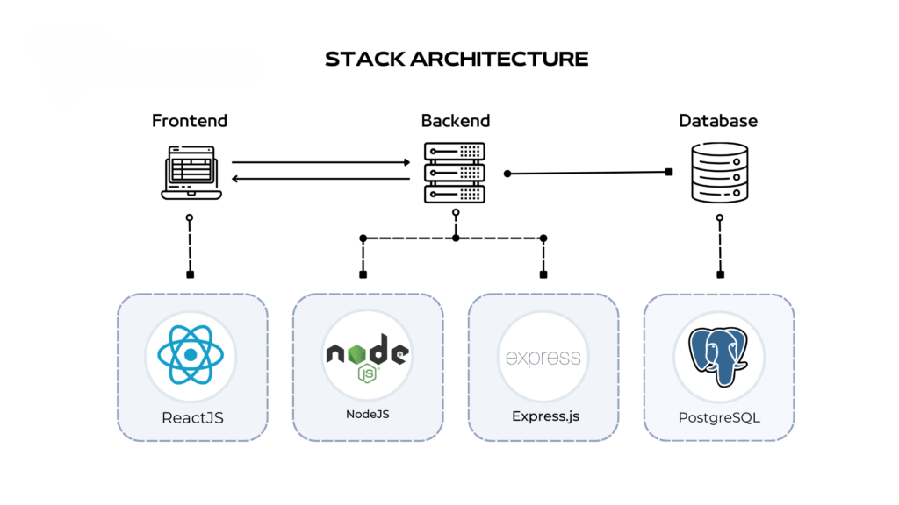
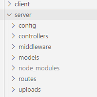
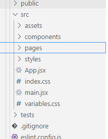
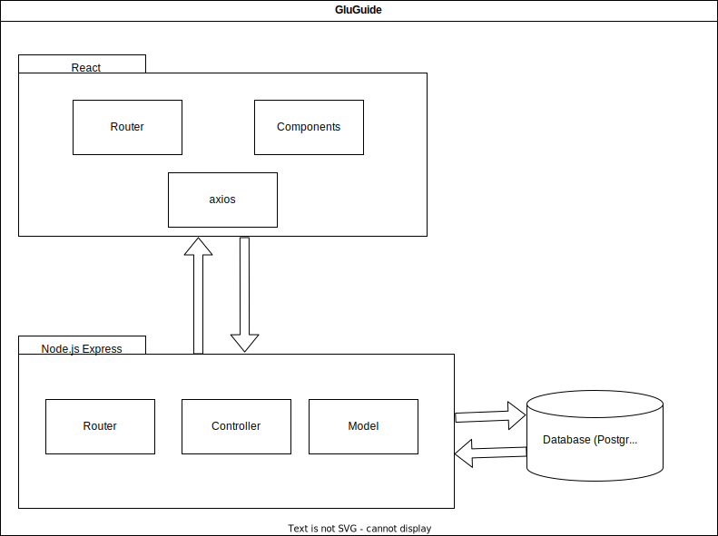
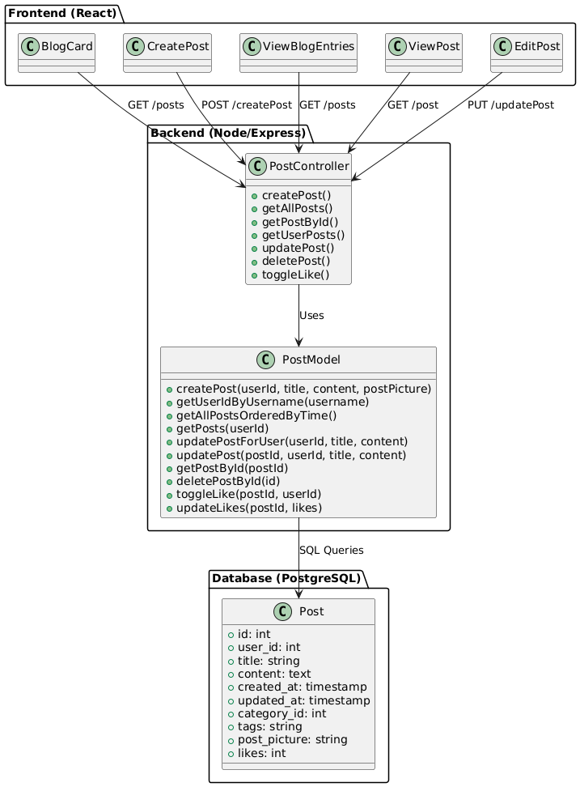
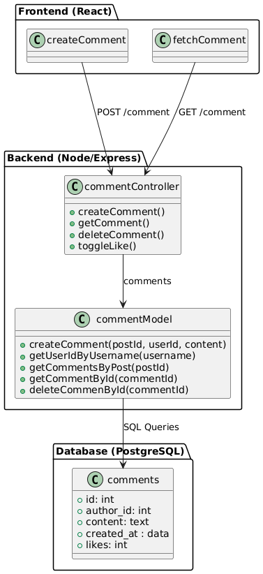
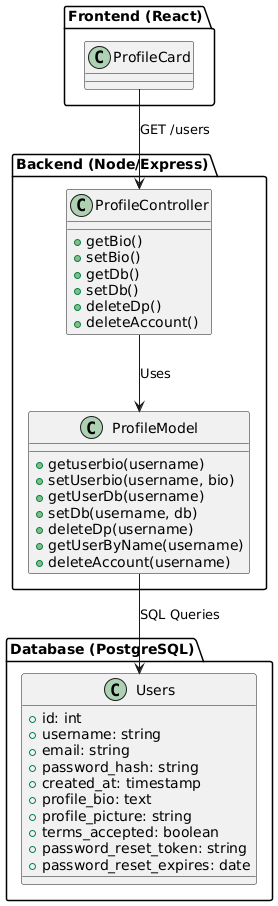
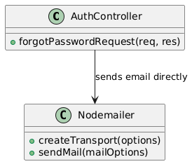
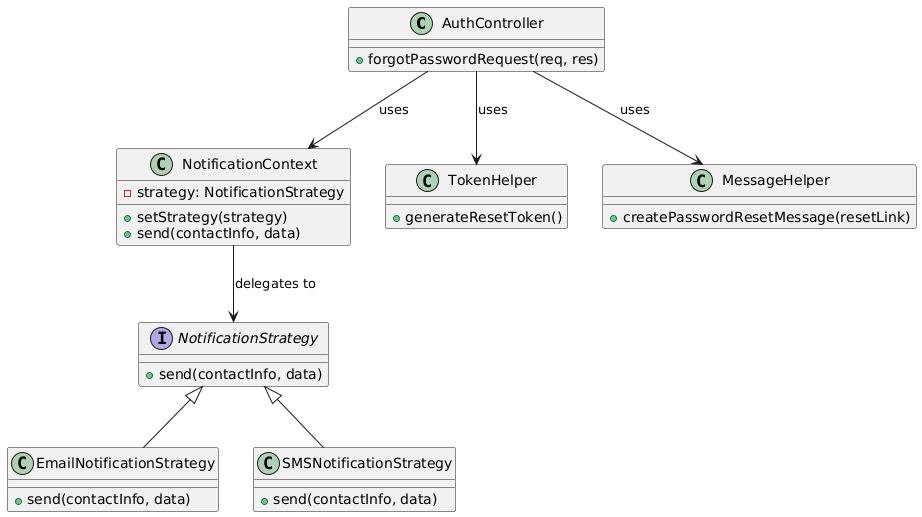

# Software Architecture Document

# Table of Contents
- [Introduction](#1-introduction)
    - [Purpose](#11-purpose)
    - [Scope](#12-scope)
    - [Definitions, Acronyms and Abbreviations](#13-definitions-acronyms-and-abbreviations)
    - [References](#14-references)
    - [Overview](#15-overview)
- [Architectural Representation](#2-architectural-representation)
- [Architectural Goals and Constraints](#3-architectural-goals-and-constraints)
- [Use-Case View](#4-use-case-view)
- [Logical View](#5-logical-view)
    - [Overview](#51-overview)
    - [Architecturally Significant Design Packages](#52-architecturally-significant-design-packages)
    - [Refactoring with Design Patterns](#53-refactoring-with-design-patterns)
- [Process View](#6-process-view)
- [Deployment View](#7-deployment-view)
- [Implementation View](#8-implementation-view)
- [Data View](#9-data-view)
- [Size and Performance](#10-size-and-performance)
- [Quality](#11-quality)

## 1. Introduction

### 1.1 Purpose
This document provides a comprehensive architectural overview of the system, using a number of different architectural views to depict different aspects of the system. It is intended to capture and convey the significant architectural decisions which have been made on the system.

### 1.2 Scope
This document describes the technical architecture of the GluGuide project, including the structure of classes, modules and dependencies.

### 1.3 Definitions, Acronyms and Abbreviations

| Abbrevation | Description                            |
| ----------- | -------------------------------------- |
| API         | Application programming interface      |
| MVC         | Model View Controller                  |
| REST        | Representational state transfer        |
| SDK         | Software development kit               |
| SRS         | Software Requirements Specification    |
| UC          | Use Case                               |
| VCS         | Version Control System                 |
| n/a         | not applicable                         |

### 1.4 References

| Title                                                              | Date       | Publishing organization   |
| -------------------------------------------------------------------|:----------:| ------------------------- |
| [GluGuide Blog](https://gdewomenhealth.wordpress.com/?_gl=1%2Aowhejp%2A_gcl_au%2ANjg0NDgyODI1LjE3MjYxMzk0NDA)| 07.11.2024 |GluGuide  |
| [GitHub Repository](https://github.com/millisom/GluGuide)| 07.11.2024 |GluGuide  |
| [Overall Use Case Diagram](https://github.com/millisom/GluGuide/blob/5112acab63e2a801674f5f804d32cb34232c55d7/docs/UCD3.drawio.svg)| 21.05.2025 |GluGuide  |
| [SRS](SRS.md)| 07.11.2024 |GluGuide  |
| [UC:Create Account](UCCreateAccount.md)| 07.11.2024 |GluGuide  |
| [UC:Edit Account](UCEditAccount.md)| 07.11.2024 |GluGuide  |
| [UC:Delete Account](UCDeleteAccount.md)| 07.11.2024 |GluGuide  |
| [UC:Log in and Log out](UCLogin_logout.md)|07.11.2024 | GluGuide |
| [UC:Manage Blogpost](UCManagePost.md)| 07.11.2024 |GluGuide  |
| [UC:Manage Comments](UCManageComment.md)| 07.11.2024 |GluGuide  |
| [UC:Like Post](UCLikePost.md)| 16.11.2024 |GluGuide  |
| [UC:Like Comments](UCLikeDislikeComment.md)| 16.11.2024 |GluGuide  |
| [UC:Reset Password](UCResetPassword.md)|05.04.2025 | GluGuide |
| [UC:Manage Admin Accounts](UCManageAdmins.md)|19.04.2025 | GluGuide |
| [UC:Create Recipe](UCCreateRecipe.md)|21.04.2025 | GluGuide |
| [UC:Log Macros](UCLogMacros.md)|21.04.2025 | GluGuide |
| [UC:Log Meals](UCLogMeal.md)|21.04.2025 | GluGuide |
| [UC:Manage Glucose Logs](UCManageGlucoseLogs.md)|15.04.2025 | GluGuide |
| [UC:Generate Graphs](UCGenerateGraph.md)|15.04.2025 | GluGuide |
| [UC:Manage Alerts](UCManageAlerts.md)|15.04.2025 | GluGuide |

### 1.5 Overview
This document contains the Architectural Representation, Goals and Constraints as well
as the Logical, Deployment, Implementation and Data Views.

## 2. Architectural Representation
The back-end server uses Node.js + Express for REST APIs, front-end side is a React.js client with React Router and Axios. We follow the Model-View-Control.

  

In the backend we have folders for our 'model' and 'controller' files.

  

In our frontend we manage the 'view' with components implemented on pages.

  

## 3. Architectural Goals and Constraints
As mentioned in the second chapter, frontend and backend are using MVC pattern. This enables a clean software architecture with separate view, controller and model. 

### Front-end
React serves as the front-end framework. It manages the UI and consumes data via API calls

### Back-end
Node.js and Express provides the back-end framework, offering RESTful endpoints for the front-end to use.

The front-end and back-end are spearate but communicate via a REST API.
They are both written in Javascript. 

## 4. Use-Case View
Our overall UC diagram:

  

## 5. Logical View

### 5.1 Overview
The our project our elements are categorized by model, view and controller.
Data Flow:

  

1. User Interaction (view)
    A user interaction will trigger a function to handle the form submission.
2. Request Handling (Controller)
    The Controller receives the request, validates the data and passes it to the model.
3. Database Interaction (Model)
    Model interacts with our database and performes operations.
4. Response (Controller & View) 
    The Controller sends back the result (success or error), which is then handled by the view to update the user interface accordingly.

Generating an Architectural UML diagram for a JavaScript (JS) application are challenging because most UML tools and generators are geared toward object-oriented languages (like Java or C#) with strict class-based structures.
We've tried PlantUML and UML Generator in VSC but they didnt work.
In Intelij PlantUML works, but it does not automatically generate UML Diagrams, but we have to code Diagrams ourselfs.

[You can see our components here.](https://github.com/millisom/GluGuide/tree/4e6ddeddb950e6e31f96191412fb1557652970ea/gluGuideSetup/client/src/components)

This is the class diagram for the feature Authentification

  

This is the class diagram for the feature POST

  

This is the class diagram for the feature Comment

  

This is the class diagram for the feature Profile

  

### 5.2 Architecturally Significant Design Packages
- Multer (File Upload Middleware)
- Quill (Text Editor)
- Axios (HTTP Client)
- Vite (Deployment performance)

These can be considered architectually significant.

---

### 5.3 Refactoring with Design Patterns

In addition to the MVC structure, we have refactored parts of our backend using the **Strategy Pattern**.

Specifically, in the `forgotPasswordRequest` feature inside `authController.js`, we introduced a **Strategy Pattern** for handling notifications (sending password reset emails).  
This refactor separates the notification logic from the controller logic and makes it easier to later extend notification channels (for example: Email, SMS, Push Notifications) without modifying the controller.

---

#### 5.3.1 Refactoring Summary

| **Before** | **After (Strategy Pattern)** |
|------------|-------------------------------|
| Notification (Email sending) was handled directly inside the controller | Notification logic is separated into a Strategy class |
| Hard to extend to other notification methods | Easily extendable (add new strategies like SMS, Push) |
| Tight coupling between controller and specific email implementation | Loose coupling through dynamic strategies |

---

#### 5.3.2 Implementation Details

- Created an abstract `NotificationStrategy` class/interface.
- Created `EmailNotificationStrategy` as a concrete implementation.
- Created a `NotificationContext` class to dynamically choose and use a notification strategy.
- The controller now delegates the notification responsibility to the context.

**Classes created:**
- `NotificationStrategy.js`
- `EmailNotificationStrategy.js`
- `NotificationContext.js`

**Affected Controller:**
- `authController.js` ➔ `forgotPasswordRequest(req, res)`

---

#### 5.3.3 Diagrams: Before and After Refactoring

##### Before Refactoring (Direct Dependency)

The following UML diagram shows the structure before applying the Strategy Pattern:

- The controller (`AuthController`) was directly responsible for sending the email using Nodemailer.
- No separation of concerns.

---

##### After Refactoring (With Strategy Pattern)

The following UML diagram shows the structure after refactoring with the Strategy Pattern:

- `NotificationContext` uses a `NotificationStrategy` to send a notification.
- `EmailNotificationStrategy` is a concrete strategy implementation for email.
- `SMSNotificationStrategy` is already prepared as a future extension to support SMS notifications.
- `TokenHelper` is responsible for generating password reset tokens and expiry timestamps.
- `MessageHelper` is responsible for dynamically creating the password reset email message.
- With this structure, the controller (`AuthController`) delegates all responsibilities cleanly, making the system easier to extend, maintain, and scale without modifying the controller logic itself.

---

#### 5.3.4 Advantages of the Refactoring

- **Open/Closed Principle**: The code is now open for extension but closed for modification.
- **Better Separation of Concerns**: The controller only handles request/response, not notification details.
- **Easier Maintenance**: Changes to notification methods do not affect the controller.
- **Extensibility**: Adding new notification types (SMS, Push) is simple and clean.

---

## 6. Process View
        
n/a

## 7. Deployment View

Our Deployment setup includes a client and a server. 

            ┌─────────────────────────────────────┐
            │                                     │
            │          React Frontend             │
            │              Client                 │
            │                                     │
            └────────────────┬────────────────────┘
                             │
                             │
       ┌─────────────────────▼─────────────────────┐
       │                                           │
       │       Node.js + Express Backend           │
       │                  Server                   │
       │                                           │
       └─────────────────────┬─────────────────────┘
                             │
                             │
                             ▼
                 ┌──────────────────────┐
                 │Database (PostgreSQL) │
                 │                      │
                 └──────────────────────┘

## 9. Data View
Our database structure in a schema:

  

## 10. Size and Performance
n/a

## 11. Quality/Metrics

n/a
