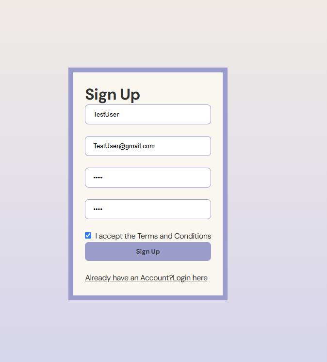

# 1 Use-Case Name
Create Account

## 1.1 Brief Description
A user can create a new account to access the web application. During account creation, the user provides essential information such as:

- **Username**
- **Email**
- **Password**
- **Confirm Password**

The system validates the input and stores the user's information. After successful account creation, the user is either logged in automatically or prompted to log in.

## 2. Basic Flow
1. The user navigates to the registration page.
2. The user fills in the following fields:
   - Email
   - Password
   - Username
3. User can click "Cancel" to exit the form without creating an account.
4. The user submits the form by clicking the "Create Account" button.
5. The system validates the user's input:
   - Ensures the email format is valid.
   - Checks that the password meets strength requirements.
   - Ensures that the username is unique and available.
6. If validation is successful, the system stores the user's account information in the database.
7. The system confirms the account creation by showing a success message.
8. (Optional) The system sends a verification email to the user's email address.
9. (Optional) The user is either logged in automatically or redirected to the login page.

### 2.1 Activity Diagram


### 2.2 Mock-up
This is the sign up page:<br>
<br>

### 2.3 Alternate Flow:
- **Invalid Input:**
   - If the user provides an invalid email or weak password, the system displays an error message and asks the user to correct the form.
- **Duplicate Email/Username:**
   - If the email or username already exists, the system prompts the user to choose a differen
### 2.4 Narrative
```gherkin
Feature: Create Account
    As a new user
    I want to create an account
    So that I can access the web application
  
  Scenario: Open account creation page
    Given I am on the homepage
    When I click the "Register" button
    Then I am redirected to the "Create Account" page

  Scenario: Enter valid data and create an account
    Given I am on the "Create Account" page
    When I enter "myusername" in the "Username" field
    And I enter "myemail@example.com" in the "Email" field
    And I enter "mypassword" in the "Password" field
    And I press the "Create Account" button
    Then I receive a "Success" message
    And I am redirected to the "My Account" page

  Scenario: Enter invalid data and receive error message
    Given I am on the "Create Account" page
    When I enter "myusername" in the "Username" field
    And I enter "invalid-email" in the "Email" field
    And I enter "short" in the "Password" field
    And I press the "Create Account" button
    Then I remain on the "Create Account" page
    And I receive an "Error" message
```

## 3. Preconditions:
- **User Access:** The user is on the registration page of the web application, which is accessible from the home page or other entry points.
- **Authentication Status:** The user is not logged into the system. If the user is already logged in, they will be automatically redirected to their dashboard or shown a message informing them that they cannot create a new account while logged in.
- **Network and Server Connection:** The registration page is fully functional, with an active connection to the backend services (e.g., database, authentication servers).
- **Form Availability:** All required fields (e.g., username, email, password) are visible and accessible on the form, with proper client-side validation scripts in place (e.g., for email format, password strength).
- **User Information:** The user has not previously created an account using the same email or username, which will be checked during the submission process.

## 4. Postconditions:
- **Account Creation:** A new user account is successfully created in the database. This includes:
   - Storing the user’s username, email, and hashed password (along with any other optional data) in a secure manner.
   - Ensuring the account details adhere to the system’s validation rules (e.g., unique email and username, strong password).
- **User Authentication:** Depending on the configuration:
   - The user may be automatically logged in after account creation and redirected to their profile page or dashboard.
   - Alternatively, the user may be shown a login prompt, requiring them to manually log in using the newly created credentials.
- **Verification Process (Optional):** If email verification is enabled:
   - The system sends a verification email to the user’s provided email address, containing a link or token that must be confirmed to activate the account fully.
   - The account status will be set as "unverified" until the user completes the email verification step.
- **Error Handling (Optional):** In the event of issues during the process (e.g., server downtime, network issues), the system will display an error message, asking the user to try again later or contact support.
- **User Notification:** A confirmation message is displayed, informing the user that the account was created successfully. If verification is required, the message will also mention the next steps (e.g., “Please check your email to verify your account.”).
- **Session Management:** If the user was logged in automatically, a new session is created, and the session data is securely stored, allowing them to stay logged in during future interactions until they log out manually or the session expires.

## 5. Exceptions:
- **System Failure**: If the system encounters an issue during account creation (e.g., server is down), it informs the user to try again later.

## 6. Link to SRS:
This use case is linked to the relevant section of the [Software Requirements Specification (SRS)](SRS.md).

## 7. CRUD Classification:
- **Create**: This use case represents the **Create** operation in CRUD as it handles the creation of a new user account.

