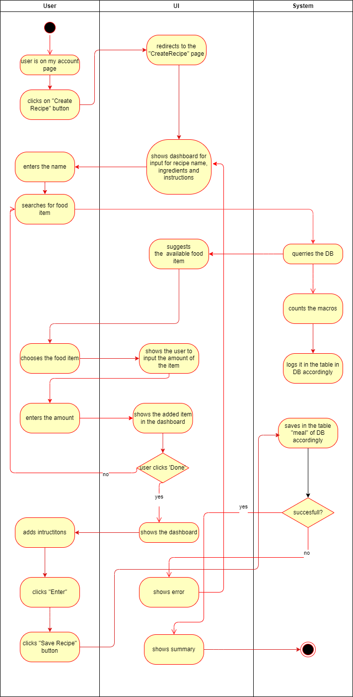

# Use-Case Specification: Create Recipe | Version 1.0

## 1. Use-Case: Create Recipe  
### 1.1 Brief Description  
This use case describes the process where users can create a custom recipe by specifying ingredients, adding cooking instructions, and saving it to the database. The recipe becomes available for future use in meal planning and nutritional analysis.

---

## 2. Basic Flow  

### 2.1 Create a Recipe
1. The user navigates to the **Create Recipe Page**.
2. The system renders the **Recipe Dashboard** interface.
3. The user enters a **recipe name**.
4. The user searches and selects **food ingredients**.
5. The user sees selected ingredients in an **IngredientList**.
6. The user writes step-by-step **instructions** using the **RecipeInstructionsInput**.
7. The user clicks **Save Recipe**.
8. The system sends a **POST request** to create the recipe.
9. On success, the system redirects the user to the page for the newly created recipe.

### 2.2 View Recipes Summary
1. The user navigates to the **Recipe Summary Page**.
2. The system fetches and displays a list of all saved recipes using **RecipesCards**.
3. Each card displays the recipe name, total calories, and a button to view the full recipe.

### 2.3 View Recipe Details
1. The user clicks on **View Recipe**.
2. The system routes to `/recipes/:id` and fetches full recipe data.
3. The **RecipeCard** component displays:
   - Recipe name
   - List of ingredients
   - Instructions
   - Nutritional info
4. The user can choose to **delete the recipe**.

---

### 2.4 Activity Diagram  


---

### 2.5 Mock-up  
- Create Recipe UI


- Input


- Recipe Summary


- Recipes Overview


---

## 3. Alternate Flows  

- **Missing Recipe Name**  
  - System displays: `"Please enter a recipe name"` and blocks submission.

- **No Ingredients Added**  
  - System displays: `"Please add at least one ingredient"`.

- **No Instructions Provided**  
  - System displays: `"Please add instructions"`.

- **Failed Save Request**  
  - System displays: `"Failed to create recipe"`.

- **Failed Recipe Fetch**  
  - System displays: `"Failed to load recipe."` on RecipeCard view.

- **Recipe Deleted**  
  - System displays: `"Recipe deleted successfully."` and hides content.

---

## 4. Narrative  

```gherkin
Feature: Create a custom recipe
  As a user
  I want to create and save recipes
  So that I can reuse them in meal planning

  Scenario: Successfully create a recipe
    Given I am on the Create Recipe page
    When I enter a name, ingredients, and instructions
    And I click Save Recipe
    Then the system saves the recipe
    And redirects me to the RecipeCard page

  Scenario: View all saved recipes
    Given I have saved recipes
    When I navigate to the Recipe Summary page
    Then I see recipe cards with name and calories

  Scenario: View one recipe in detail
    Given I have saved recipes
    When I click on View Recipe
    Then I see full recipe data: ingredients, steps, macros

  Scenario: Delete a recipe
    Given I am viewing a recipe
    When I click Delete
    Then the system removes the recipe and shows confirmation
```

---

## 5. Preconditions  

### 5.1 User Access  
The user must be authenticated and authorized to create recipes.

### 5.2 Network & Backend  
The backend API and database must be available to handle API calls.

### 5.3 Form Availability  
- Recipe name input, food item search, and instructions input must be accessible.
- The system must have proper validation on the client side.

---

## 6. Postconditions  

### 6.1 Recipe Storage  
The recipe is stored in the database with:
- Recipe name
- Ingredient list (with food_id and quantity)
- Instructions
- Nutritional summary

### 6.2 UI Feedback  
User is redirected to the RecipeCard view and receives confirmation.

### 6.3 Recipe Availability  
The recipe is now available in:
- Meal logging via `RecipeSelector`
- Recipes summary and search

---

## 7. Exceptions  

### 7.1 API or Server Errors  
- Display appropriate error messages.
- Do not clear user input so they can retry.

---

## 8. Link to SRS  
This use case is linked to the relevant section of the [Software Requirements Specification (SRS)](SRS.md).

---

## 9. CRUD Classification  

### 9.1 Create and Read Operation  
This use case falls under **CREATE**, **READ** and **DELETE** in the CRUD model:
- Create: When a new recipe is saved
- Read: When listing and viewing recipe data
- Delete: When a recipe is removed from the database
