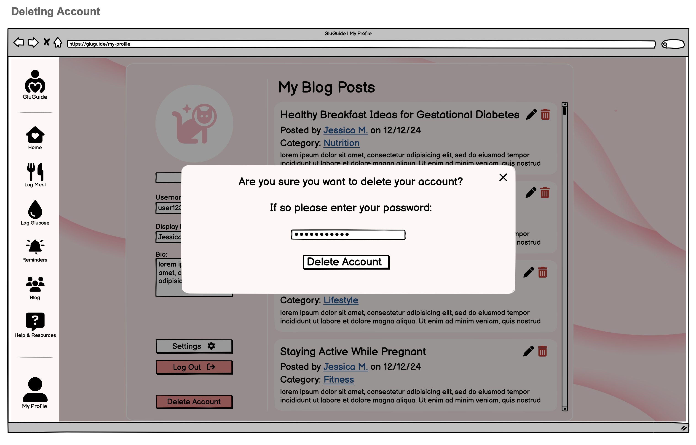

# 1 Use-Case Name
Delete Account

## 1.1 Brief Description

This use case enables a registered user to delete their account. Upon deletion, all personal data (e.g., posts, comments, 
tracking records) is permanently erased in compliance with data privacy standards. This operation is irreversible and 
requires confirmation.

---

## 2. Basic Flow

1. **Navigation**: The user logs in and navigates to the _User Profile_ page.
2. **Delete Account Option**: The user selects the _“Delete Account”_ option.
3. **Confirmation Prompt**: A modal dialog appears, prompting the user to confirm deletion with a warning about the 
permanence of this action.
4. **Password Entry**: The user must type in their password within the confirmation modal as an extra verification step.
5. **User Confirmation**: After entering the password, the user clicks _“Yes, Delete My Account.”_
6. **System Validation**: The system verifies the user’s authentication and checks that the entered password is correct.
7. **Data Removal**: The system deletes the user account and all associated data.
8. **Logout and Redirect**: The user is logged out, shown a confirmation message, and redirected to the homepage.

### 2.1 Activity Diagram


### 2.2 Mock-up


### 2.3 Alternate Flow:

**User Cancels Deletion:**
* In the confirmation modal, the user clicks _“No, Cancel.”_
* The deletion process is aborted, and the user is returned to the Account Settings page with no changes.

### 2.4 Narrative
```gherkin
Feature: Delete Account
    As a registered user
    I want to delete my account
    So that my data is permanently removed from the application
  
  Scenario: Open account deletion page
    Given I am logged in
    And I am on the "User Profile" page
    When I click the "Delete Account" button
    Then a confirmation modal appears

  Scenario: Enter password and confirm deletion
    Given the confirmation modal is open
    When I enter my password in the "Password" field
    And I click the "Yes, Delete My Account" button
    Then I receive a "Your account has been successfully deleted" message
    And I am logged out
    And I am redirected to the homepage

  Scenario: Cancel account deletion
    Given the confirmation modal is open
    When I click the "No, Cancel" button
    Then the modal closes
    And I remain on the "Account Settings" page
```

---

## 3. Preconditions:

* **User Authentication**: The user is logged into their account and authenticated. Access to the Delete Account feature 
is restricted to logged-in users only.

* **Account Settings Access**: The user is on the User Profile page, where the Delete Account option is visible and accessible.

* **Network and Server Connection**: The system is connected to the backend services (e.g., database, authentication servers) 
required to validate the user's credentials and complete the deletion request without errors.

* **Modal Accessibility**: The confirmation modal and its elements (password field, confirmation buttons) load correctly 
when the Delete Account option is selected.

* **Security and Verification Checks**: The system is configured to prompt for the user's password within the modal, ensuring 
additional verification before proceeding with account deletion.

---

## 4. Postconditions:

* **Account Deletion:** The user’s account and all associated data are permanently removed from the system, including:
  * Deleting the user’s profile, posts, comments, and tracking records.
  * Ensuring all user-related data is erased in compliance with data privacy regulations and policies.
* **User Logout**: Upon successful deletion:
  * The user is automatically logged out of the system.
  * Any active sessions related to the user’s account are terminated to prevent access to now-deleted data.
* **Confirmation and Redirect**: After deletion:
  * The user sees a final confirmation message stating that their account has been successfully deleted.
  * The system redirects the user to the homepage or login page.
* **Error Handling**: In the event of an issue during deletion (e.g., network failure or server error):
  * The system displays an error message, prompting the user to try again later or contact support if the issue persists.
  * If the deletion was not completed, the user’s data and account remain intact, and they are returned to the Account Settings page.
* **Audit Log (Optional)**: If logging is enabled:
  * The system records the account deletion event, including the date, time, and user ID, to maintain a secure audit trail.
  * Security Assurance: Any tokens or cookies associated with the deleted account are invalidated to prevent unauthorized access.

---

## 5. Exceptions:

* **System Failure:** If a server or network issue occurs during the deletion process, the system displays an error message 
informing the user that account deletion could not be completed. The user is advised to try again later or contact support 
if the problem persists.
* **Invalid Password**: If the user enters an incorrect password during the confirmation step, the system prompts them 
to re-enter the correct password before proceeding with the deletion. The account deletion process will not continue 
until the correct password is provided.
* **Session Timeout**: If the user’s session expires while on the Account Settings page or during the deletion process, 
they are redirected to the login page. They will need to log in again to access Account Settings and repeat the deletion steps.
* **Database Error**: If an issue occurs while attempting to delete the user’s data from the database, the system informs 
the user that the deletion failed. The account and data remain intact, and the user can try the deletion process again 
once the issue is resolved.

---

## 6. Link to SRS:

This **Delete Account** use case aligns with the requirements outlined in the **Software Requirements Specification (SRS)** document, 
ensuring functionality, security, and data compliance for account deletion:

- **[Section 3.1.4 - Functionality: Deleting Account](SRS.md#314-delete-account)**  
   This section describes the basic functionality of account deletion, ensuring that all user data (e.g., posts, comments, tracking records) is permanently removed upon account deletion. The **Delete Account** use case elaborates on this requirement by specifying the steps users must take to delete their account, including password confirmation to prevent unauthorized deletions.

- **[Section 3.2 - Usability: Security](SRS.md#32-usability)**  
   Deleting an account involves sensitive data handling, aligning with the **Usability** requirements in this section. The password confirmation step before deletion is a critical security measure that complies with the application’s data protection policies, making users aware of the permanence of this action.

- **[Section 3.3 - Reliability](SRS.md#33-reliability)**  
   The **Reliability** requirements emphasize system uptime and data integrity. In the **Delete Account** use case, exceptions handle system failures or connection issues, ensuring that users are notified of any issues and that their data remains intact if deletion cannot be completed successfully.

- **[Section 3.4 - Performance](SRS.md#34-performance)**  
   Real-time response is necessary for the deletion confirmation modal, providing immediate feedback for password validation and deletion success or failure. This ensures that users experience minimal latency, contributing to a seamless account deletion process.

- **[Section 3.5 - Supportability](SRS.md#35-supportability)**  
   The **Delete Account** use case is developed in alignment with the modular architecture specified in the **Supportability** section, ensuring easy maintenance and clear separation between user interface, backend processes, and data handling components.

For more detailed requirements, refer to the [Software Requirements Specification (SRS)](SRS.md) document.

---

## 7. CRUD Classification:
* **Delete**: This use case represents the Delete operation in CRUD as it handles the permanent deletion of a user account 
and all associated data.
