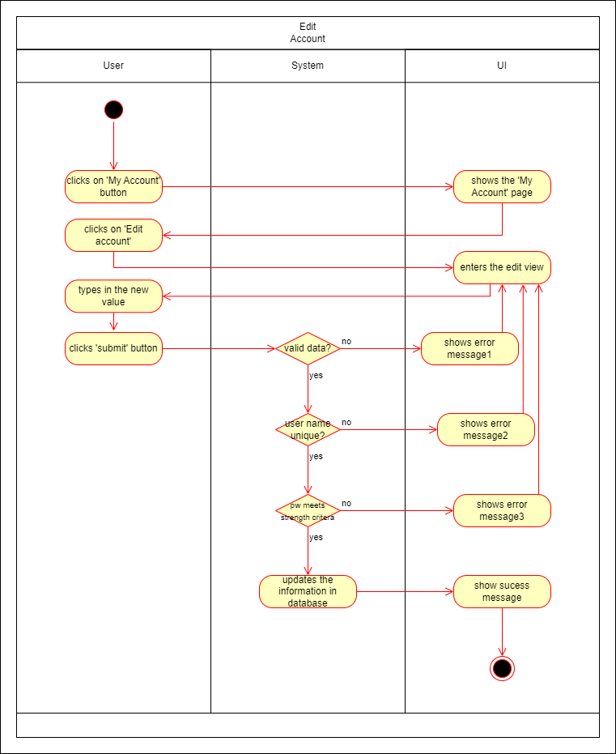
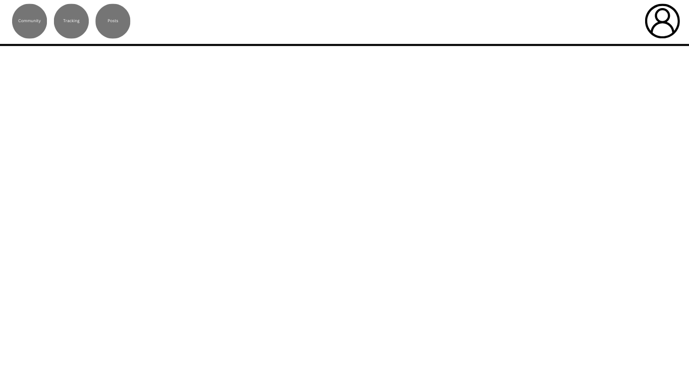
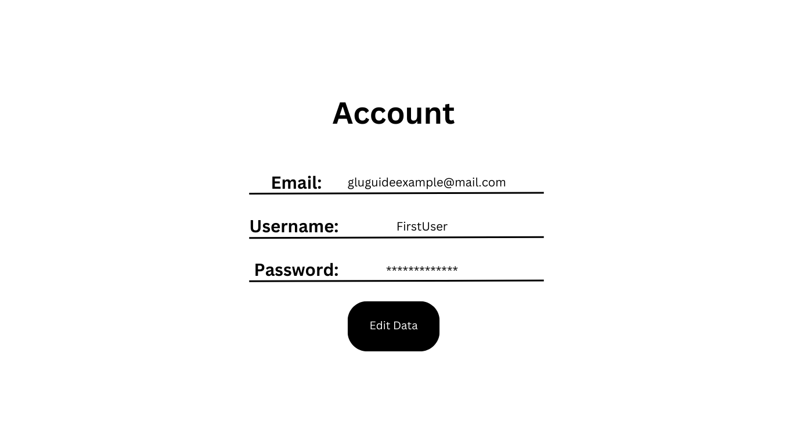
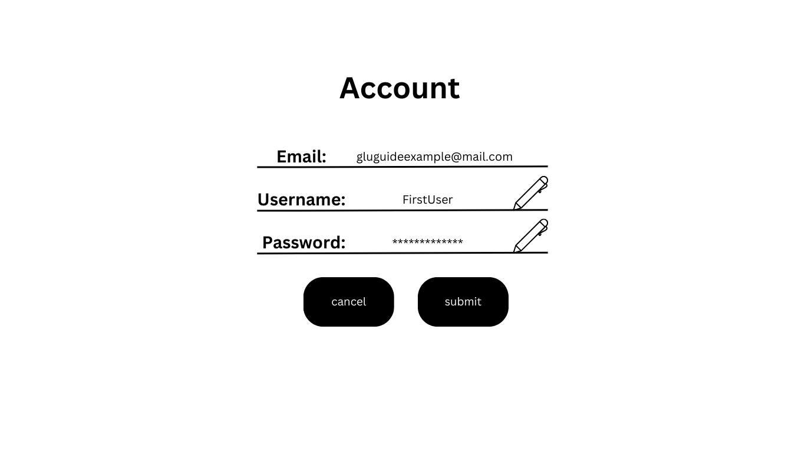
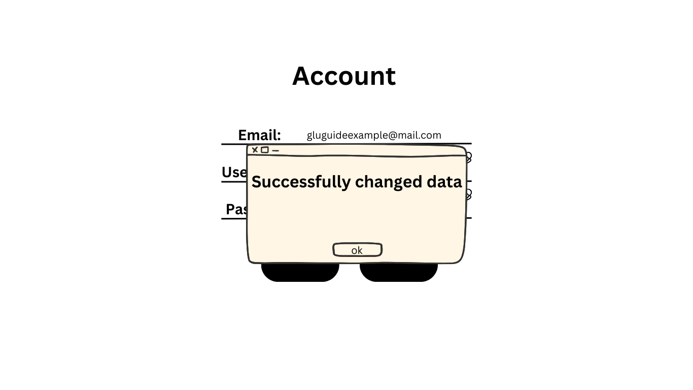

# 1 Use-Case Name
Edit Account

## 1.1 Brief Description
A user can edit the data that is linked to their account such as:

- **Username**
- **Password**

The user can edit one value at a time. The system validates the input, stores the user's information, and may require email verification. 

## 2. Basic Flow
1. The user navigates to the account page.
2. The user clicks 'edit account'
3. The user clicks on 'change password' button or 'change username' button
3. The user types in a new value.
4. The system validates the user's input:
   - Ensures the format is valid.
   - Checks that the password meets strength requirements.
   - Ensures that the username is unique and available.
5. If validation is successful, the system updates the user's account information in the database.
6. The system confirms the account edit by showing a success message.
7. (Optional) The system sends a verification email to the user's email address.

### 2.1 Activity Diagram


### 2.2 Mock-up

This is the profile page:<br>
<br>

This is the Mock-up for edit Account Data:






### 2.3 Alternate Flow:
- **Invalid Input:**
   - If the user provides an invalid user name or weak password, the system displays an error message and asks the user to correct the form.
- **Duplicate Username:**
   - If the username already exists, the system displays an error message and informs the user, that the username is already taken.

### 2.4 Narrative
```gherkin
Feature: Edit Account
    As a user
    I want to edit my account information
    So that I can change my username or password
  
  Scenario: Open account page
    Given I am logged in
    And I am on the landingpage
    When I click the "Account" button
    Then I am redirected to the "Account" page

  Scenario: Enter valid data and change username
    Given I am on the "Account" page
    When I click on the "Edit Data" button
    And I enter "myusername" in the "Username" field
    And I press the "submit" button
    And the username is not taken already
    Then I receive a "Success" message
    And I am redirected to the "Account" page

Scenario: Enter valid data and change password
    Given I am on the "Account" page
    When I click on the "Edit Data" button
    And I enter "%dh5!XEX" in the "password" field
    And I press the "submit" button
    Then I receive a "Success" message
    And I am redirected to the "Account" page

  Scenario: Enter invalid data and receive error message
    Given I am on the "Account" page
    When I enter "short" in the "Password" field
    And I press the "submit" button
    Then I remain on the "Edit Account" page
    And I receive an "Error" message
```

## 3. Preconditions:
- **User Access:** The user is on the landing page of the web application, which is accessible from the home page or other entry points.
- **Authentication Status:** The user is logged into the system.
- **Network and Server Connection:** The "Edit Accout" page is fully functional, with an active connection to the backend services (e.g., database, authentication servers).
- **Form Availability:** All required fields (e.g., username, email, password) are visible and accessible on the form, with proper client-side validation scripts in place (e.g., for email format, password strength).

## 4. Postconditions:
- **Account Edit:** The user account data is successfully edited in the database. This includes:
   - Storing the user’s username, email, and hashed password (along with any other optional data) in a secure manner.
   - Ensuring the account details adhere to the system’s validation rules (e.g., unique email and username, strong password).
- **User Authentication:** Depending on the configuration:
   - The user may be automatically stay logged in after account editing and redirected to their profile page or dashboard.
   - Alternatively, the user may be shown a login prompt, requiring them to manually log in using the newly created credentials.
- **Verification Process (Optional):** If email verification is enabled:
   - The system sends a verification email to the user’s provided email address, containing a link or token that must be confirmed to edit the accountdata fully.
   - The account status will be set as "unverified" until the user completes the email verification step.
- **Error Handling (Optional):** In the event of issues during the process (e.g., server downtime, network issues), the system will display an error message, asking the user to try again later or contact support.
- **User Notification:** A confirmation message is displayed, informing the user that the account was edited successfully. If verification is required, the message will also mention the next steps (e.g., “Please check your email to verify your edit.”).
- **Session Management:** If the user stayed logged in automatically, a new session is created, and the session data is securely stored, allowing them to stay logged in during future interactions until they log out manually or the session expires.

## 5. Exceptions:
- **System Failure**: If the system encounters an issue during account editing (e.g., server is down), it informs the user to try again later.

## 6. Link to SRS:
This use case is linked to the relevant section of the [Software Requirements Specification (SRS)](SRS.md).

## 7. CRUD Classification:
- **UPDATE**: This use case represents the **UPDATE** operation in CRUD as it handles the update of a user account.

