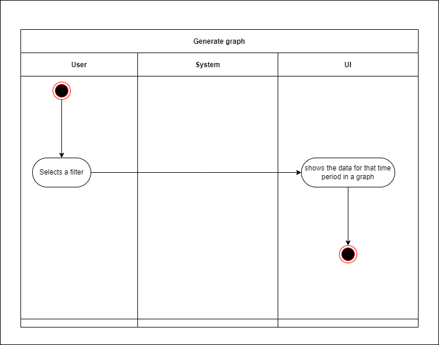
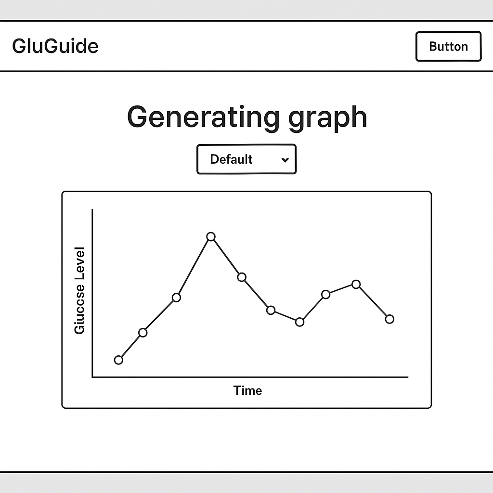

# Use-Case Specification: Generate Graph | Version 1.0

## 1. Use-Case: Generate Graph  
### 1.1 Brief Description  
This feature automatically displays a graph of the user's logged glucose levels. While it is part of the Manage Glucose Logs module, the graph is always visible and provides valuable insights at a glance. Users can apply different time filters (e.g., Daily, Weekly, Monthly) to change the graph's data view, but no additional action is required to generate or update the graph.

---

## 2. Basic Flow

1. The user logs into the system and navigates to the **Glucose Logs** page.
2. The system automatically generates and displays a graph that visualizes the logged glucose levels using a default time filter.
3. The user can select from available time filters (e.g., Daily, Weekly, Monthly) to update the graph.
4. The system refreshes the graph based on the selected filter, allowing the user to analyze their health trends over different periods.

### 2.1 Activity Diagram  


### 2.2 Mock-up  
_Default graph view on the Glucose Logs page:_  


### 2.3 Alternate Flow  
- **No Data Available:**  
  - If there are no logged glucose entries, the graph area displays a placeholder message such as "No data available" instead of an empty graph.
- **Data Retrieval Issues:**  
  - In the event of a connection or server error, the system shows an error notification in the graph area.

### 2.4 Narrative  
```gherkin
Feature: View Glucose Graph
    As a logged-in user
    I want to view a graph of my logged glucose levels
    So that I can monitor my health trends over time

  Scenario: View default graph
    Given I am logged in
    And I navigate to the "Glucose Logs" page
    Then I should automatically see a graph displaying my glucose data
    And the graph uses the default time filter

  Scenario: Update graph filter
    Given I am on the "Glucose Logs" page with a displayed graph
    When I select a different time filter (e.g., "Weekly" or "Monthly")
    Then the graph is updated to reflect the selected time period
```
## 3. Preconditions:
- **User Access:** The user is on the glucose logs page of the web application, which is accessible from the home page.
- **Authentication Status:** The user is logged into the system.
- **Network and Server Connection:** The graph generation component is fully operational, with an active connection to backend services (e.g., the database storing glucose logs).
- **Data Availability:** The user's logged glucose levels must exist in the system to create a meaningful graph.
- **Client Capability:** The user's browser supports dynamic graph rendering (e.g., via JavaScript libraries) to display the graph correctly.

---

## 4. Postconditions:
- **Graph Generation:** The system successfully retrieves the user's glucose log data and dynamically generates a graph that visualizes these values.
- **Filtering Accuracy:** When the user applies a time filter (e.g., daily, weekly, or monthly), the graph updates accurately to reflect the filtered data.
- **User Insight:** The graph that's generated gives the user a visual idea of their glucose trends over the selected time period.

---

## 5. Exceptions:
- **No Data Available:** If no glucose log data is available, the system displays a clear message (e.g., "No data available") instead of an empty graph.
- **System Failure:** If an error occurs during graph generation (e.g., due to network issues or server downtime), the system notifies the user with an error message, suggesting that they try again later.

---

## 6. Link to SRS:
This feature is linked to the relevant section of the [Software Requirements Specification (SRS)](SRS.md).

---

## 7. CRUD Classification:
- **READ:** This feature represents a **READ** operation in CRUD, as it retrieves and visualizes existing glucose log data without altering it.
