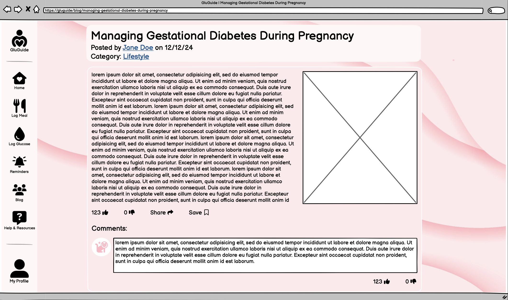

# 1 Use-Case Name
Like/Dislike Comments

## 1.1 Brief Description

This use case enables a user to like or dislike a comment under a blog post. A user can only choose to like or dislike each comment, not both. Clicking the button for an already-selected action (like/dislike) will remove that action.

---

## 2. Basic Flow

1. **Navigation**: The user logs in and navigates to the comments section of a blog post.
2. **Like/Dislike Button Interaction**: The user clicks on the "Like" or "Dislike" button under a comment.
3. **System Check**: The system verifies if the user has already liked or disliked the comment.
4. **Toggle Reaction Status**: 
    * If liked: Clicking "Dislike" removes the like and adds a dislike.
    * If disliked: Clicking "Like" removes the dislike and adds a like.
    * If neutral: Clicking "Like" or "Dislike" adds the corresponding reaction.
5. **Display Update**: The system updates the like/dislike count on the comment to reflect the current reaction status.

### 2.1 Activity Diagram


### 2.2 Mock-up


### 2.3 Alternate Flow:

**User Removes Reaction:**
* If the user clicks the already-selected reaction (like or dislike), the reaction is removed, resetting the comment’s status to neutral.

### 2.4 Narrative
```gherkin
Feature: Like or Dislike Comments
    As a registered user
    I want to like or dislike comments
    So that I can express my opinion on specific comments

  Scenario: User likes a comment
    Given I am logged in
    And I am viewing a comment
    When I click the "Like" button
    Then my like is recorded
    And the like count increases by one

  Scenario: User dislikes a comment
    Given I am logged in
    And I am viewing a comment
    When I click the "Dislike" button
    Then my dislike is recorded
    And the dislike count increases by one

  Scenario: User removes like/dislike
    Given I am logged in
    And I have liked or disliked the comment
    When I click the "Like" or "Dislike" button again
    Then my reaction is removed
    And the like/dislike count updates accordingly
```

---

## 3. Preconditions:

* **User Authentication**: The user is logged in.

* **Comment Access**: The user has navigated to a post with comments and can see the "Like" and "Dislike" buttons.

---

## 4. Postconditions:

* **Reaction Count Update:** The like or dislike count for the comment updates in real-time.
* **Reaction Status**: The system records the user’s current reaction for future reference.

---

## 5. Exceptions:

* **Network Error:** If a network error occurs, the system displays an error message, and the reaction operation is aborted.
* **Session Expiry:**: If the user’s session expires, they are prompted to log in again before performing the action.

---

## 6. Link to SRS:

This **Like/Dislike Comment** use case aligns with the requirements outlined in the **Software Requirements Specification (SRS)** document, supporting functionality, usability, and performance standards for user engagement on comments:

- **[Section 3.1.6 - Functionality: Manage Comment](SRS.md#316-manage-comment)**  
   This section describes the ability for users to interact with comments, including the option to engage with likes and dislikes. The **Like/Dislike Comment** use case extends this functionality by specifying the rules for toggling both likes and dislikes on comments, ensuring that each user can only perform one action at a time.

- **[Section 3.2 - Usability: Security](SRS.md#32-usability)**  
   The **Like/Dislike Comment** feature aligns with secure data handling requirements, ensuring that user interactions (likes and dislikes) are securely recorded and accurately associated with each user's session.

- **[Section 3.4 - Performance: Real-Time Updates](SRS.md#34-performance)**  
   Real-time responsiveness is essential for a smooth user experience. The **Like/Dislike Comment** use case aligns with this by instantly updating the like or dislike count, reflecting users’ actions without requiring page reloads.

- **[Section 3.5 - Supportability: Code Modularity](SRS.md#35-supportability)**  
   This use case aligns with modular code requirements, ensuring that like and dislike interactions on comments are maintainable and compatible with other engagement features within the system.

For more detailed requirements, refer to the [Software Requirements Specification (SRS)](SRS.md) document.

---

## 7. CRUD Classification:

* **Update**: This use case represents the Update operation in CRUD, as it handles the toggling of both like and dislike status for comments, updating the interaction status and count associated with each comment.
