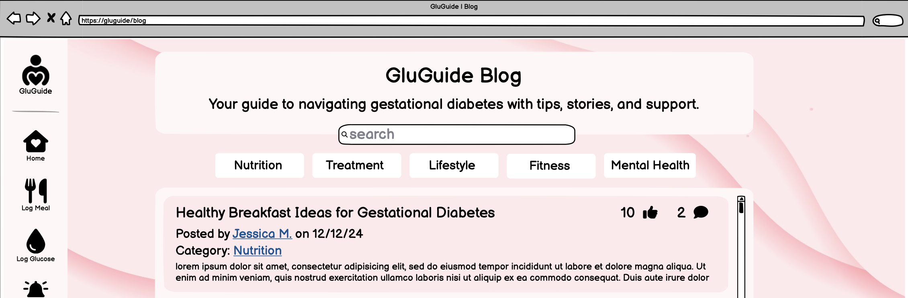

# 1 Use-Case Name
Like Post

## 1.1 Brief Description

This use case allows a registered user to like a blog post. If the user has already liked the post, clicking the "Like" button again will remove the like, effectively toggling the like status. The number of likes is updated and displayed in real-time.

---

## 2. Basic Flow

1. **Navigation**: The user logs in and navigates to a blog post they wish to like.
2. **Like Button Interaction**: The user clicks on the "Like" button below the post.
3. **System Check**: The system checks if the user has previously liked the post.
4. **Toggle Like Status**: 
    * If liked: The system removes the like.
    * If not liked: The system adds a like.
5. **Display Update**: The system updates the like count displayed on the post to reflect the change in status.

### 2.1 Activity Diagram


### 2.2 Mock-up


### 2.3 Alternate Flow:

**User Unlikes the Post:**
* If the user clicks the "Like" button on a post they've already liked, the like is removed, and the count is decremented.

### 2.4 Narrative
```gherkin
Feature: Like Post
    As a registered user
    I want to like or unlike a post
    So that I can show my appreciation for the content

  Scenario: User likes a post
    Given I am logged in
    And I am viewing a post
    When I click the "Like" button
    Then my like is recorded
    And the like count increases by one

  Scenario: User unlikes a post
    Given I am logged in
    And I have already liked the post
    When I click the "Like" button
    Then my like is removed
    And the like count decreases by one
```

---

## 3. Preconditions:

* **User Authentication**: The user is logged in.

* **Post Access**: The user has navigated to a specific post with a visible "Like" button.

---

## 4. Postconditions:

* **Like Count Update:** The like count on the post is updated in real-time.
* **Like Status**: The system correctly records the user’s current like status for future reference.

---

## 5. Exceptions:

* **Network Error:** If a network error occurs, the system displays an error message, and the like/unlike operation is aborted.
* **Session Expiry:**: If the user’s session expires, they are prompted to log in again before performing the action.

---

## 6. Link to SRS:

This **Like Post** use case aligns with the requirements outlined in the **Software Requirements Specification (SRS)** document, supporting functionality, usability, and performance expectations for user interaction with posts:

- **[Section 3.1.5 - Functionality: Manage Blogpost](SRS.md#315-manage-blogpost)**  
   This section describes the ability for users to interact with blog posts, including the option to engage through likes. The **Like Post** use case elaborates on this functionality by defining the actions and rules for toggling likes on posts.

- **[Section 3.2 - Usability: Security](SRS.md#32-usability)**  
   This section specifies secure data handling requirements. The **Like Post** feature operates in line with these requirements, ensuring that like data is securely recorded and associated with user accounts.

- **[Section 3.4 - Performance: Real-Time Updates](SRS.md#34-performance)**  
   Real-time responsiveness is essential for a smooth user experience. The **Like Post** use case aligns with this requirement by updating the like count instantly, allowing users to view accurate counts without refreshing the page.

- **[Section 3.5 - Supportability: Code Modularity](SRS.md#35-supportability)**  
   The **Like Post** use case aligns with modular code requirements, ensuring easy maintenance and compatibility with other user interaction features, like comments and dislikes.

For more detailed requirements, refer to the [Software Requirements Specification (SRS)](SRS.md) document.

---

## 7. CRUD Classification:
* **Update**: This use case represents the Update operation in CRUD, as it manages the toggling of like status for a post, modifying the count of likes associated with a post.
