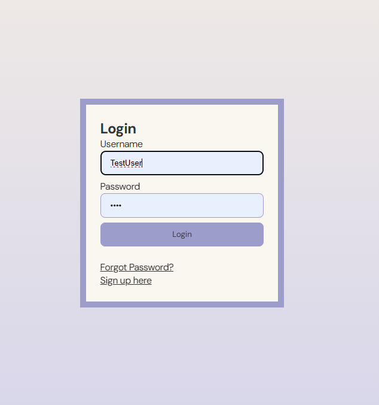

# Use-Case Name
Login/Logout

## 1. Brief Description
The Login/Logout functionality allows a user to access their account on the web application by entering their credentials and later log out to end the session. The system verifies the user credentials to grant access and manages session termination upon logout.

## 2. Basic Flow

### Login
1. The user navigates to the login page.
2. The user fills in the following fields:
   - Email/Username
   - Password
3. The user submits the form by clicking the "Login" button.
4. The system validates the user’s credentials:
   - Ensures that the email/username and password are correct and match an existing user.
5. If validation is successful, the system logs the user in and redirects them to the homepage.
6. The system displays a logout option in the "My Account" section.

### Logout
1. The user clicks the "Logout" button from the "My Account" section.
2. The system logs the user out, ends the current session, and takes them to login page.

## 2.1 Activity Diagram

## 2.2 Mock-up
This is the log in page: 
 

## 2.3 Alternate Flow

### Invalid Credentials
- If the user provides an incorrect email/username or password, the system displays an error message and requests the user to re-enter the login information.

### Session Expiration
- If the session expires while the user is still active, they are redirected to the login page, and a message is displayed, informing them that they need to log in again.

## 2.4 Narrative

### Feature: Login/Logout
  - As a user
  - I want to be able to log into and out of my account
  - So that I can securely access and terminate my session on the web application

#### Scenario: Log into the account
  - **Given** I am on the login page
  - **When** I enter valid login credentials
  - **Then** I am redirected to the homepage with a "Logout" option available

#### Scenario: Log out of the account
  - **Given** I am logged into the account
  - **When** I click the "Logout" button
  - **Then** I am redirected to the login page

#### Scenario: Attempt login with invalid credentials
  - **Given** I am on the login page
  - **When** I enter invalid login credentials
  - **Then** I receive an error message and remain on the login page

## 3. Preconditions
- The user is on the login page of the web application.
- The user is not already logged in. If logged in, they will automatically be redirected to the homepage or dashboard.
- Network and server connection are active to validate the credentials.
- User’s account exists and has valid credentials stored.

## 4. Postconditions

### Successful Login
- A session is created for the user, allowing secure access to account features.
- The user’s login status is visible, and the logout option is displayed in the "My Account" section.

### Successful Logout
- The session is terminated, and the user is redirected to the login page.

### Error Handling
- If login fails due to incorrect credentials or server issues, an error message is displayed.
- The system informs the user to try again later or contact support if server errors occur.

## 5. Exceptions
- **Invalid Credentials**: The system displays an error and prompts the user to re-enter credentials.
- **System Failure**: In case of system issues during login, the system will notify the user to retry later.

## 6. Link to SRS
This use case is linked to the relevant section of the [Software Requirements Specification (SRS)](SRS.md).
