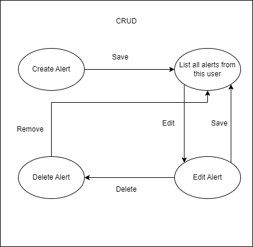
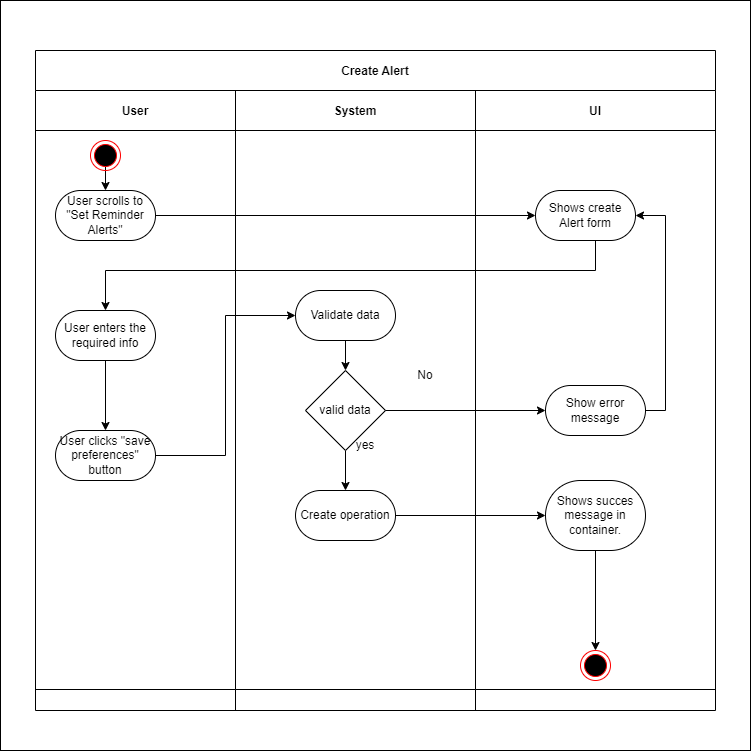
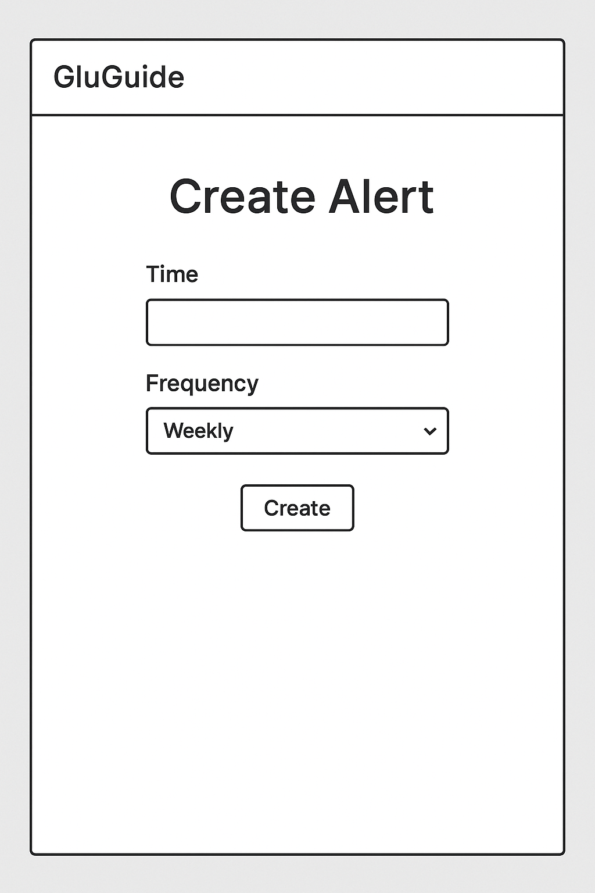
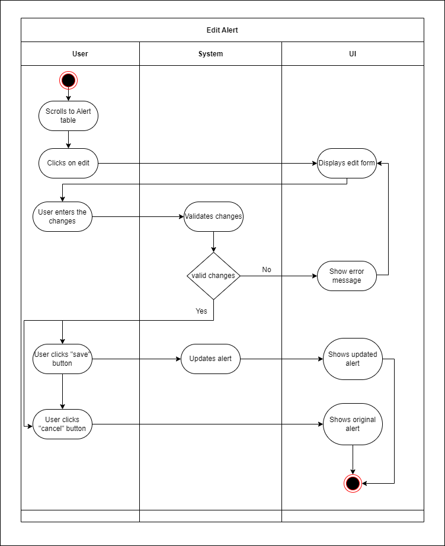
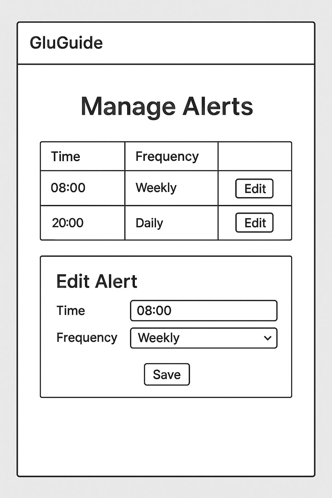
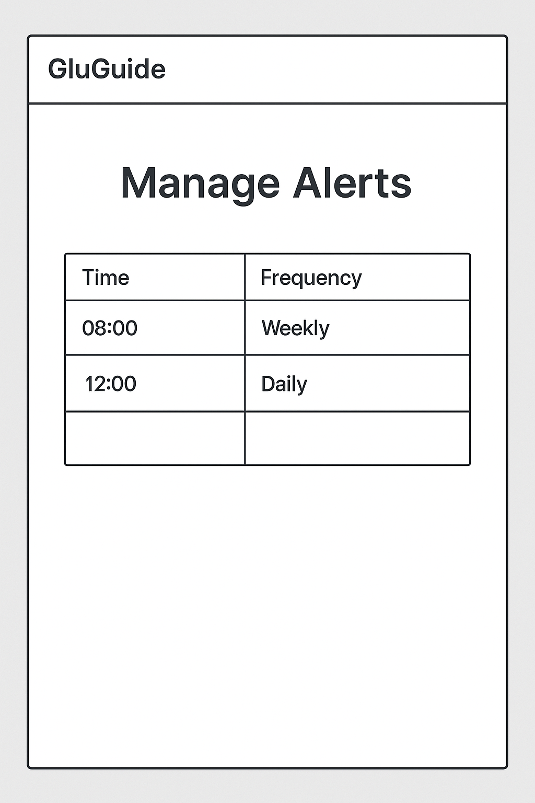
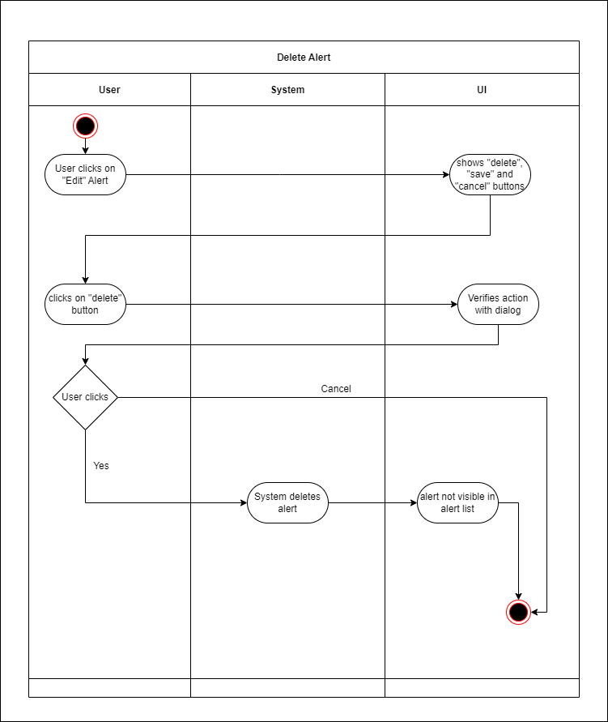
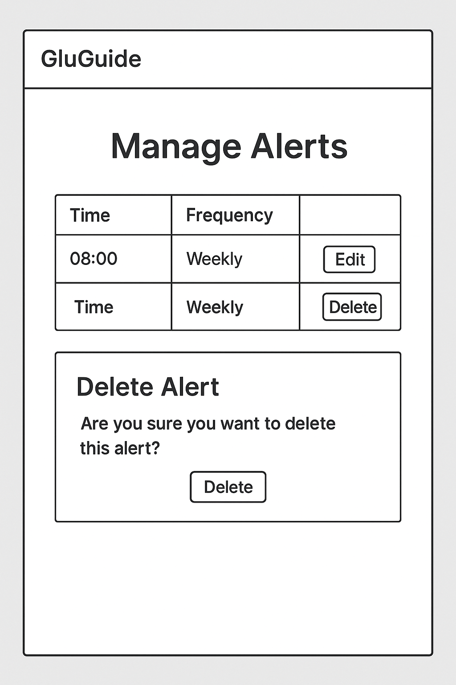

# Use-Case Specification: Manage Alerts | Version 1.1  

## 1. Use-Case: Manage Alerts  
### 1.1 Brief Description  
This use case describes the creation, listing, updating, and deleting of alerts (CRUD) for glucose logging.

---

## 2. Flow of Events  


### 2.1 Basic Flow  
In general, a user will open their dashboard, view all alerts, create a new alert, edit or delete an existing alert.

### 2.2 Creation  
The creation of a new alert requires the user to specify parameters such as time and frequency.



This was our Vision:




```gherkin
Feature: Create Alert
    As a logged-in user
    I want to create, edit, or delete alerts
    So that I can receive timely glucose reminders

  Scenario: Create a new reminder alert
    Given I am on the "Set Reminder Alerts" page
    When I select "Daily" from the "Reminder Frequency" dropdown
    And I enter a time for the reminder
    And I click the "Save Preferences" button
    Then I should see the new alert in the "Your Alerts" table
    And the alert should show the selected frequency and time

  Scenario: Cancel Create a new reminder alert
    Given I am on the "Set Reminder Alerts" page
    When I select "Daily" from the "Reminder Frequency" dropdown
    And I enter a time for the reminder
    And I leave the page
    Then I shouldnt see a the new alert in the "Your Alerts" table
```
### 2.3 Edit
During editing, the user can modify the content of the alert.



And this was our Vision:



```gherkin
Feature: Edit Alert
        As a logged in user
        I want to edit a selfwritten alert
        So that I can update an alert

    Scenario: Edit an existing reminder alert
        Given I am on the "Your Alerts" page
        When I click the "Edit" button for an existing alert
        Then I should see the "Delete", "Update", and "Cancel" buttons
        And I should be able to modify the "Reminder Frequency" and "Reminder Time"
        When I change the frequency or time
        And I click the "Update" button
        Then the alert should be updated in the "Your Alerts" table with the new values


    Scenario: Cancel editing a reminder alert
        Given I am on the "Your Alerts" page
        When I click the "Edit" button for an existing alert
        And I see the "Delete", "Update", and "Cancel" buttons
        And I modify the frequency or time
        When I click the "Cancel" button
        Then the alert should remain unchanged

```
###  2.4 List

We want to implement a table below the alert mask that displays all alerts of the logged-in user. There is no user interaction required to view them. That means there is no need for a "List Alert Diagram" here.




```gherkin
Feature: List Alerts
        As a logged in user
        I want to list all alerts
        So that I can keep an overview of my reminders

    Scenario: List Alerts
        Given I am on the "Your Alerts" page
        And I scroll past the "Setting an alert" Container
        Then I see all of my alerts
```


###  2.4 Delete

The User can delete an alert. 



And the Mockup:




```gherkin
Feature: Delete Alert
        As a logged in user
        I want to delete an alert

    Scenario: Delete a reminder alert
        Given I am on the "Your Alerts" page
        When I click the "Edit" button for an existing alert
        And I click the "Delete" button
        And a confirmation message appears
        When I click "Yes"
        Then the alert should be permanently removed from the "Your Alerts" table

    Scenario: Cancel Delete a reminder alert
        Given I am on the "Your Alerts" page
        When I click the "Edit" button for an existing alert
        And I click the "Delete" button
        And a confirmation message appears
        When I click "No"
        Then I see the alert with no changes

```

## 3. Special Requirements

### 3.1 Owning an Account  
In order to create, edit, or delete an alert, the user must have an account. Only if the user is authenticated, the alert management options will be usable.

---

## 4. Preconditions

### 4.1 The user has to be logged in  
To ensure proper privacy and security, the user must be logged in when managing alerts.

---

## 5. Postconditions

### 5.1 Create  
After creating a new alert, the user will leave the edit view and see the alert listed in a table.

### 5.2 Edit  
After the user saves their edits, the updated alert will reflect the new frequency and time in their alert settings.

### 5.3 List  
When the user requests to list all alerts, the system will fetch and display all existing alerts in a structured format.

### 5.4 Delete  
After confirming the deletion in the pop-up window, the alert will be permanently removed and no longer displayed in the table.
