# Use-Case Specification: Manage Comment | Version 1.1

## 1. Use-Case: Manage Comment  
### 1.1 Brief Description  
This use case describes the creation, reading, updating, and deleting of comments (CRUD) in the system.

---

## 2. Flow of Events  

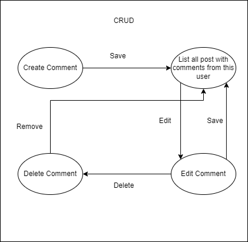

### 2.1 Basic Flow  
In general, a user will open a post, view all comments, write a comment, edit or delete a self written comment.

### 2.2 Creation  
The creation of a new comment. The user must opened a post to write a comment.

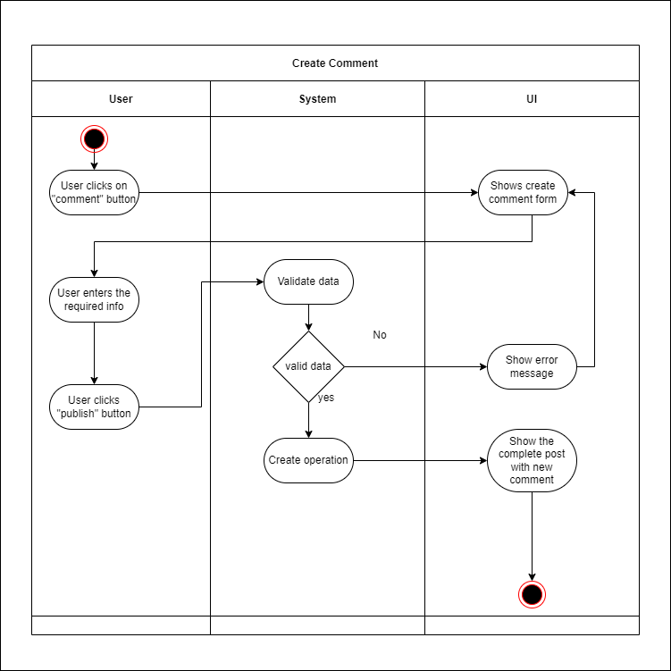
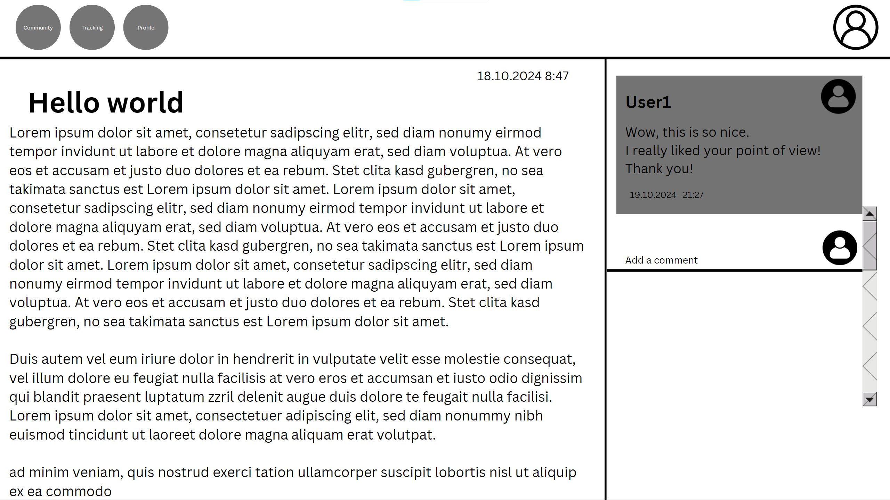
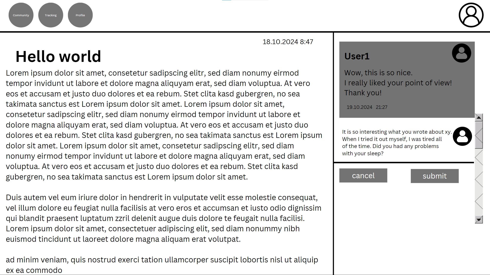
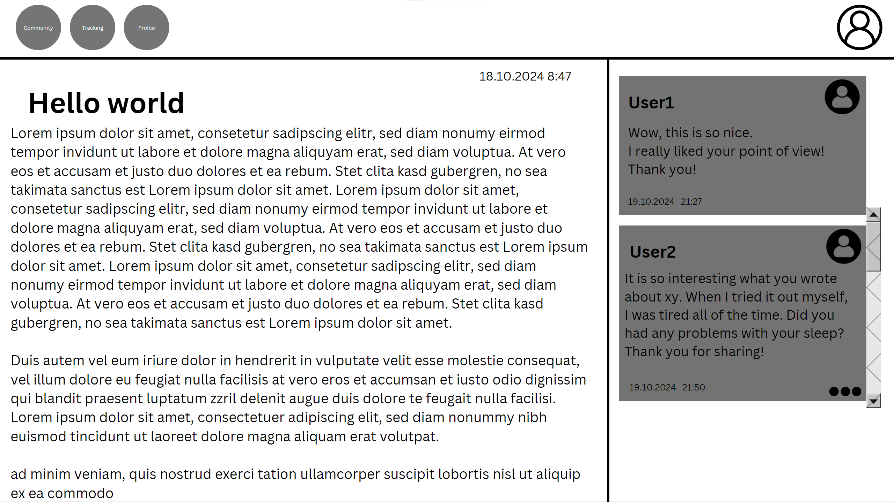

```gherkin
Feature: Create Comment
    As a logged in user
    I want to create a comment
    So that I can take part in a discussion
  
  Scenario: Create a comment
    Given I am on a blogpost page
    When I click the "comment" button
    And I start typing in a text field
    And I click on 'submit' button
    Then the comment was successfully created
    And I am redirected to the blogpost page
    And the textfield is empty
    And I see my comment

  Scenario: Cancel Create a comment
    Given I am on a blogpost page
    When I click the "comment" button
    And I start typing in a text field
    And I click on 'cancel' button
    Then I am redirected to the blogpost page
    And the text field is empty
```

### 2.3 Edit  
During editing, the user can modify the content of the comment.

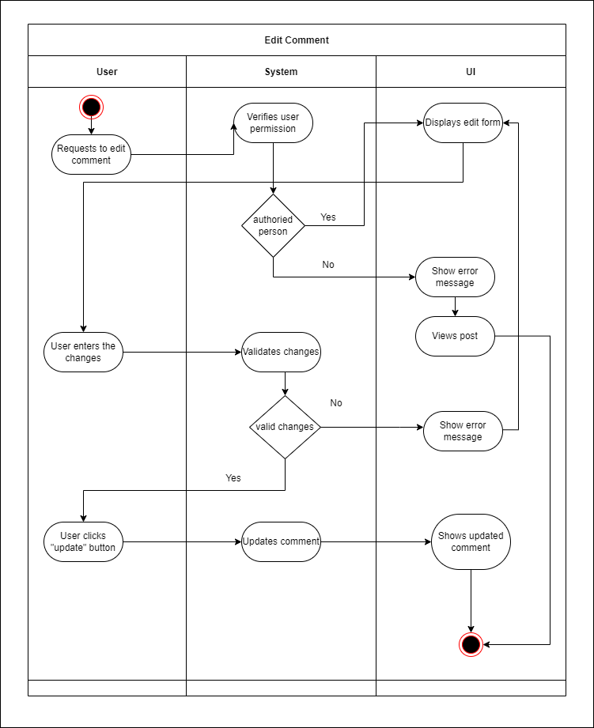


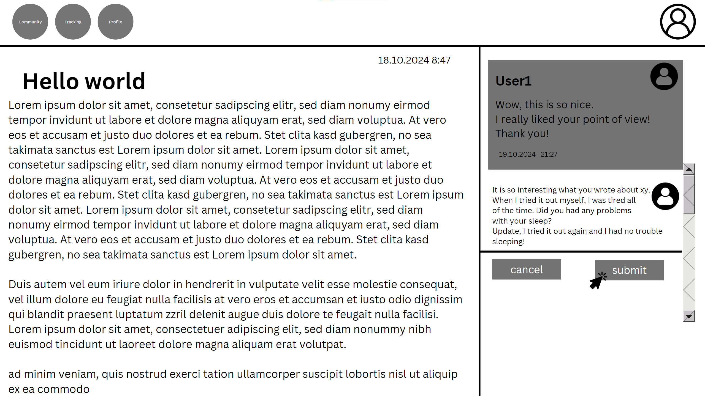
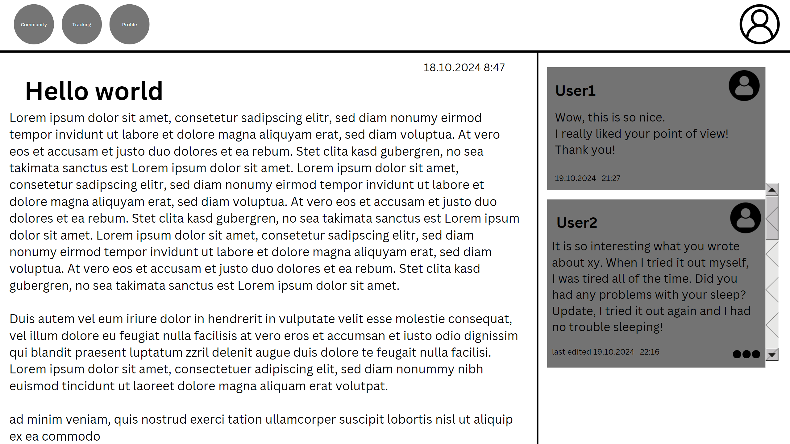

```gherkin
Feature: Edit Comment
    As a logged in user
    I want to edit a self writtencomment
    So that I can update a comment
  
  Scenario: Edit a comment
    Given I am on a blogpost page
    And I see a self written comment
    When I click the "edit" button
    And I see the text from the comment in a textfield
    And I start editing the input
    And I click on 'submit' button
    Then the comment was successfully edited
    And I am redirected to the blogpost page
    And the textfield is empty
    And I see my updated comment

  Scenario: Cancel Edit a comment
    Given I am on a blogpost page
    And I see a self written comment
    When I click the "edit" button
    And I start typing in a text field
    And I click on 'cancel' button
    Then I am redirected to the blogpost page
    And the text field is empty
    And I see the comment with no changes
```

### 2.4 List  
The user wants to be able to view all posts with their comments. Therefore, the system presents a list with all entries.

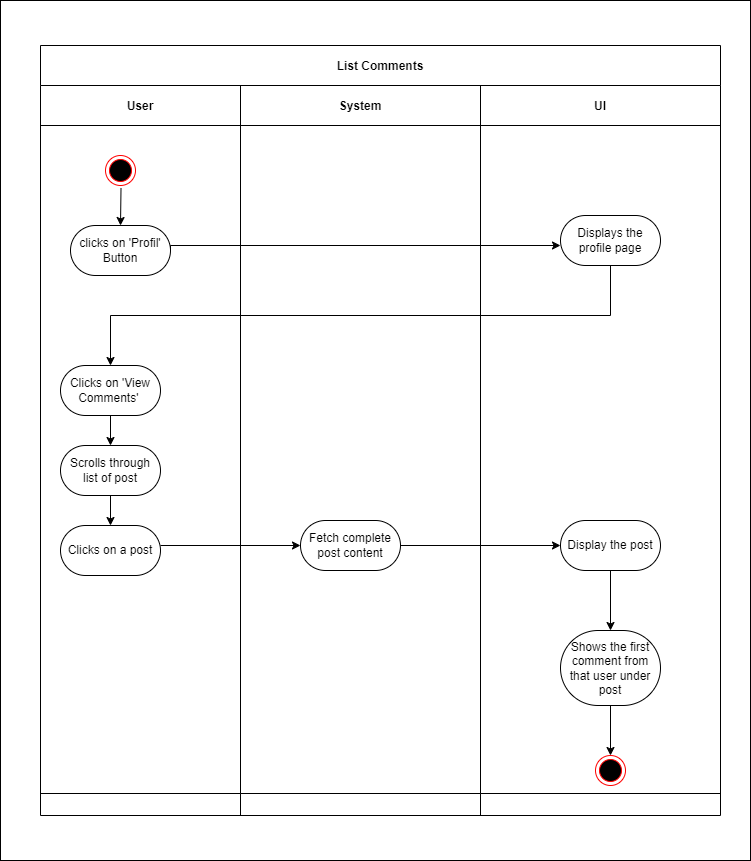
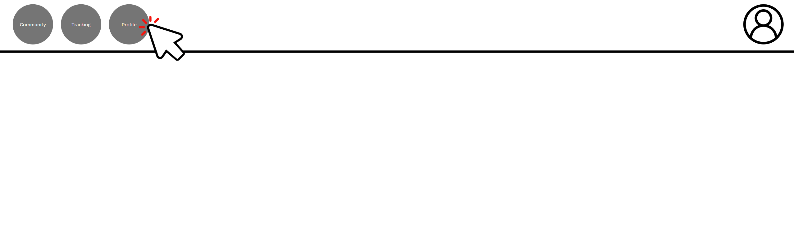
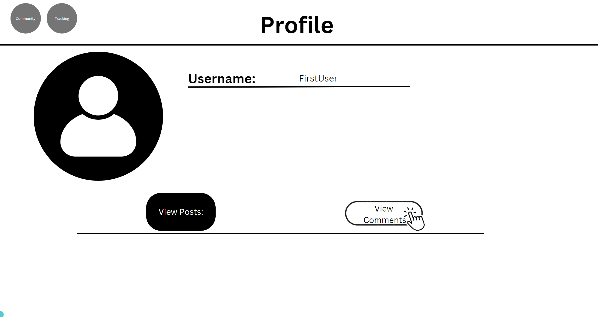
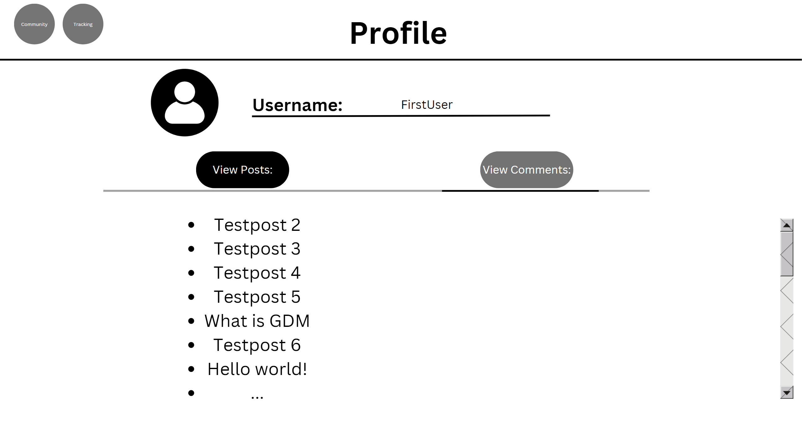

```gherkin
Feature: List Comment
    As a logged in user
    I want to list all posts where I wrote a comment
    So that I can keep an overview of my discussions
  
  Scenario: List comment
    Given I am on the landing page
    When I click the "Profile" button
    And I click on "View comments"
    And I scroll through the list of posts
    And I click on a post
    Then the post will be displayes
    And I see my comment

```

### 2.5 Delete  
The user can delete a self written comment. There is a button in the edit view to delete the comment. To ensure the user does not accidentally delete a comment, we added a modal asking for confirmation.

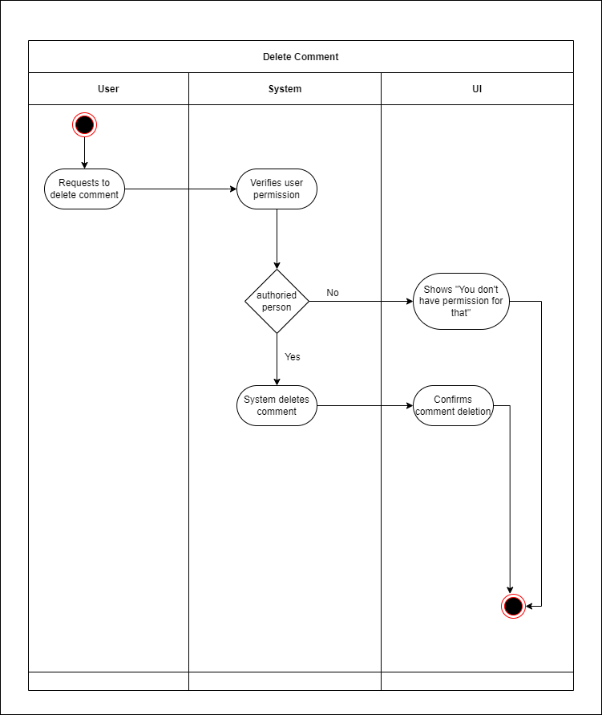

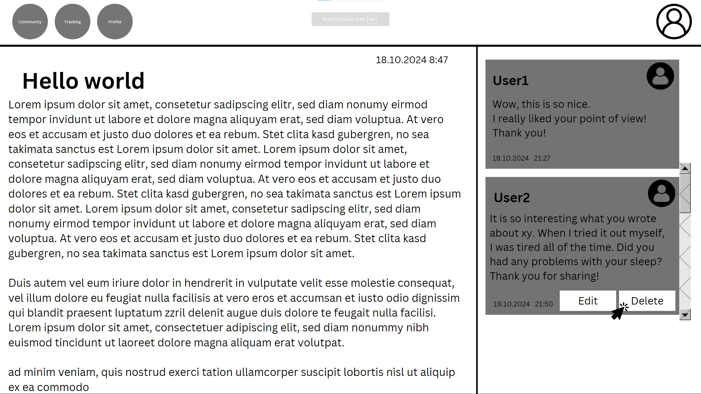
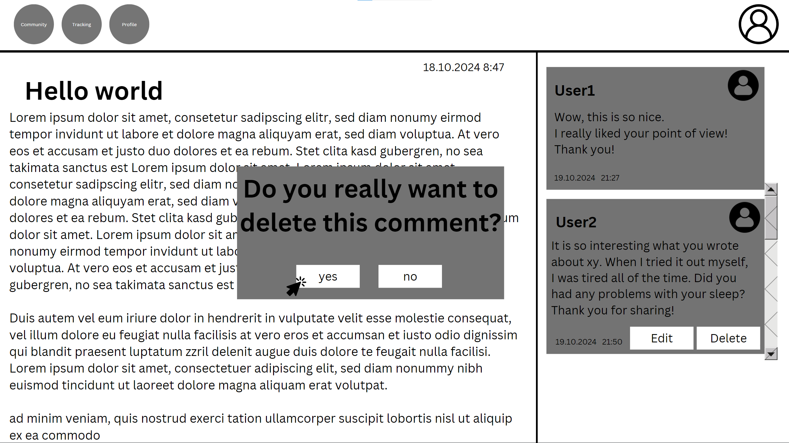
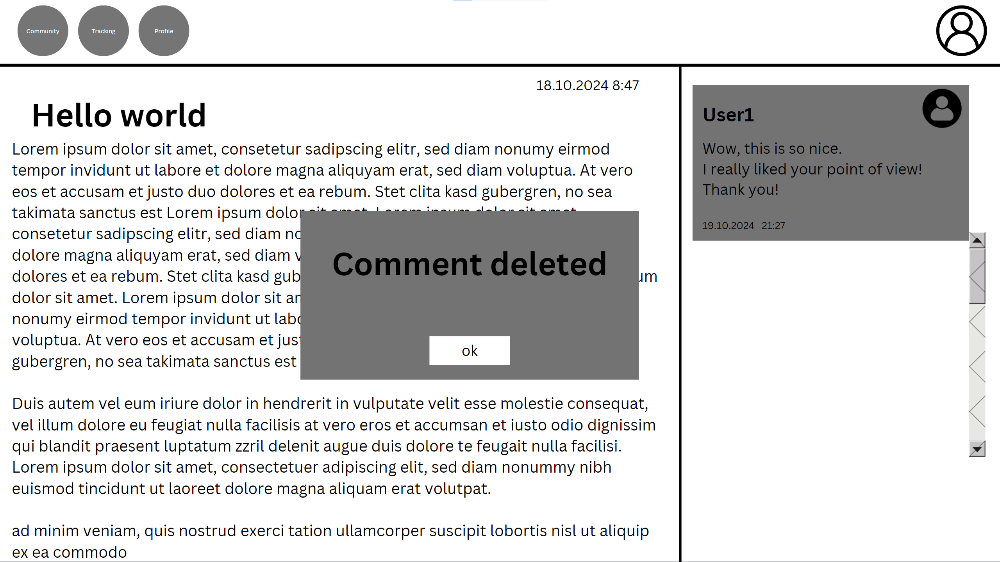

```gherkin
Feature: Delete Comment
    As a logged in user
    I want to delete a self writtencomment
  
  Scenario: Delete a comment
    Given I am on a blogpost page
    And I see a self written comment
    When I click the "delete" button
    And a message shows "Do you really want to delete this comment?"
    And I click on 'yes' button
    Then the comment was successfully deleted
    And I am redirected to the blogpost page
    And I get a confirmation message
    And the comment is gone

  Scenario: Cancel Delete a comment
    Given I am on a blogpost page
    And I see a self written comment
    When I click the "delete" button
    And a message shows "Do you really want to delete this comment?"
    And I click on 'no' button
    Then the pop up window closes
    And I see the comment with no changes

```
---

## 3. Special Requirements

### 3.1 Owning an Account  
In order to create, edit, or delete a comment, the user must have an account. Only if the user is authenticated, the dialog for commenting a posts will be visible.

---

## 4. Preconditions

### 4.1 The user has to be logged in  
To ensure proper privacy and security, the user must be logged in when managing comments.

---

## 5. Postconditions

### 5.1 Create  
After creating a new comment, the user will leave the edit view and see the post with all comments underneath.

### 5.2 Edit  
After the user saves their edits, the updated comment will be displayed under the post.

### 5.3 List  
When the user requests to list all comments, the system will fetch and display all existing posts with comments from this user in a paginated or scrollable format.

### 5.4 Delete  
After confirming the deletion in the pop up window that is shown, the comment will be permanently removed and no longer displayed under the post and in the list overview.
