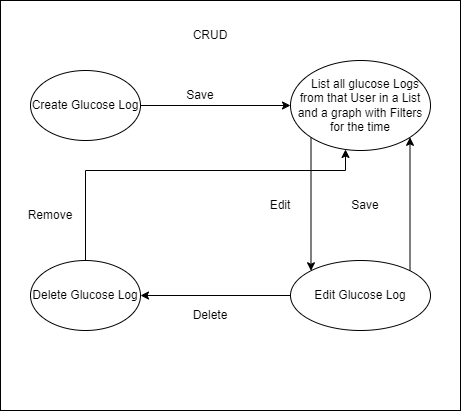
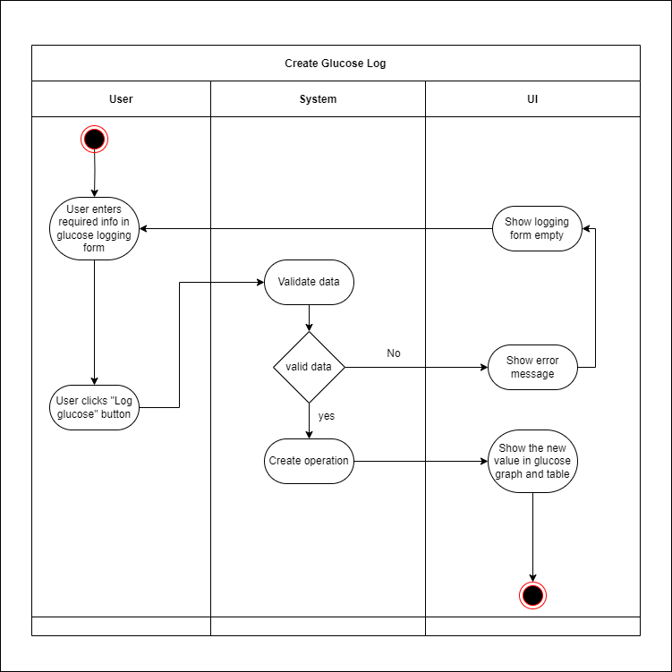
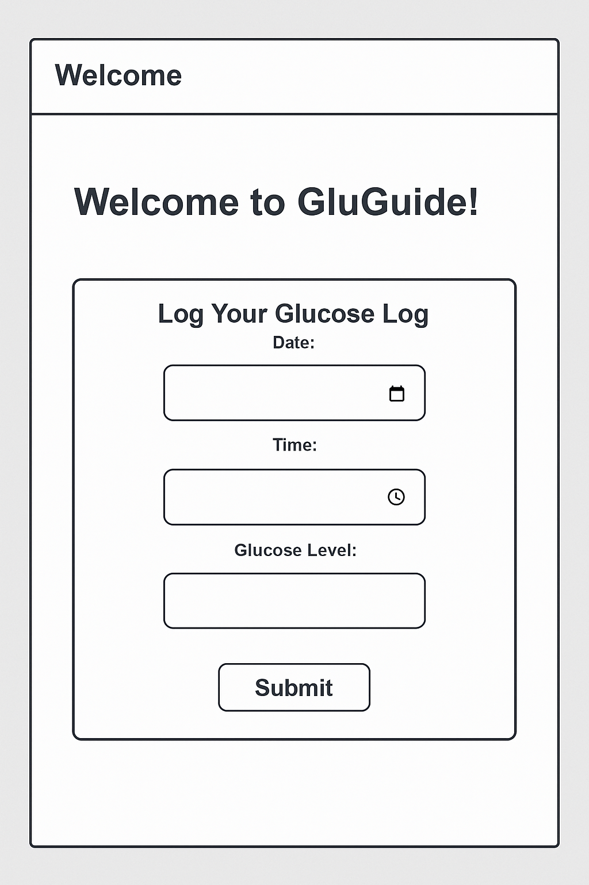
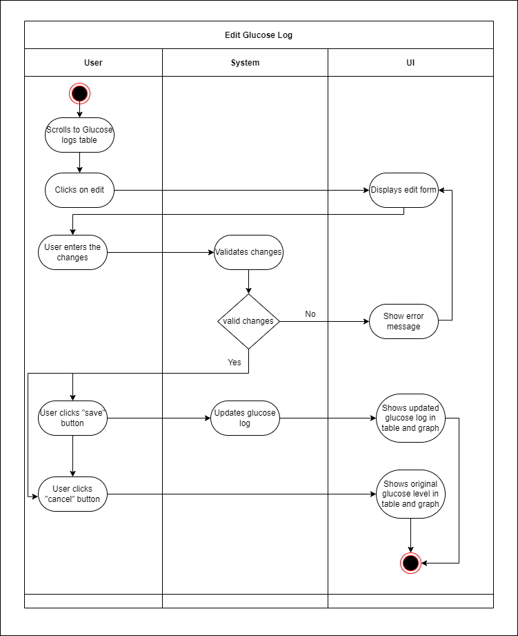
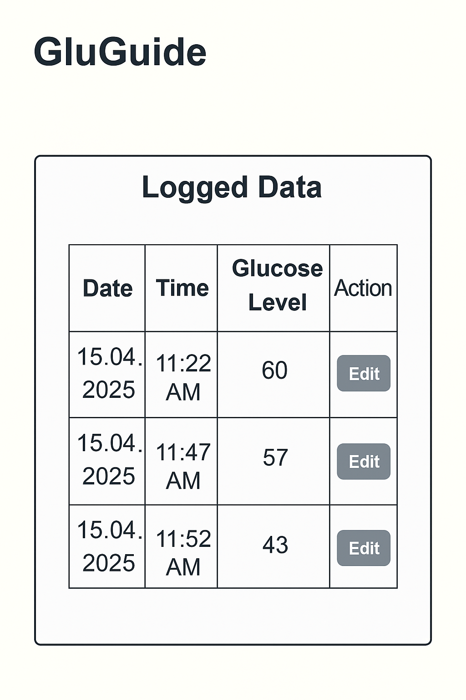
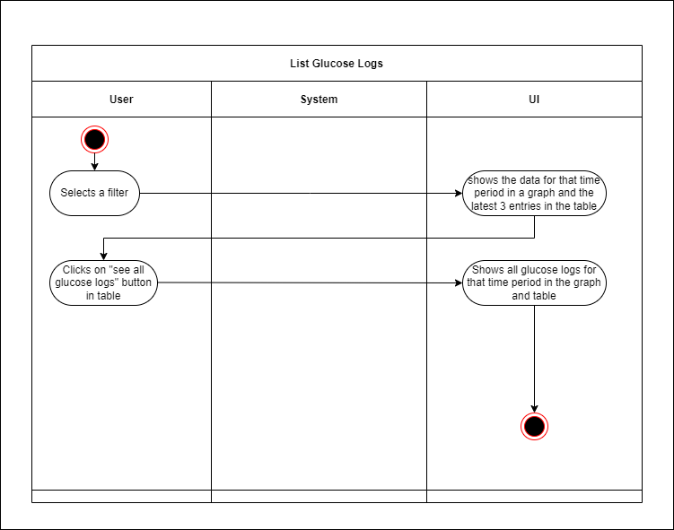
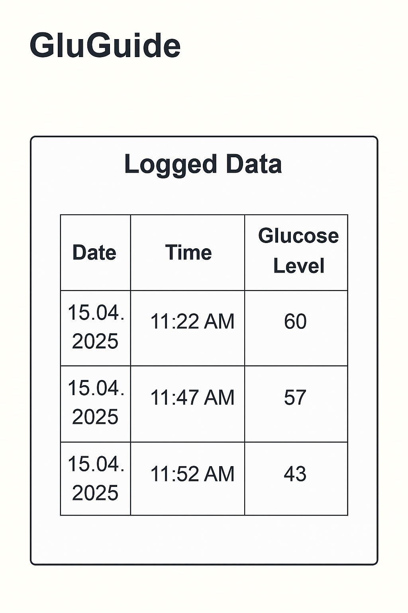
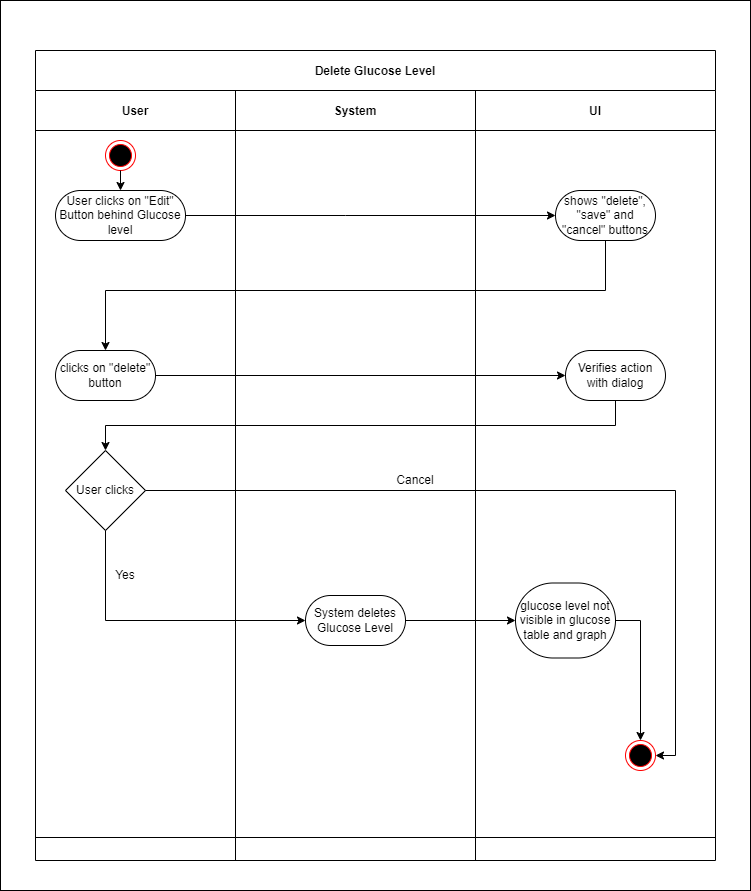
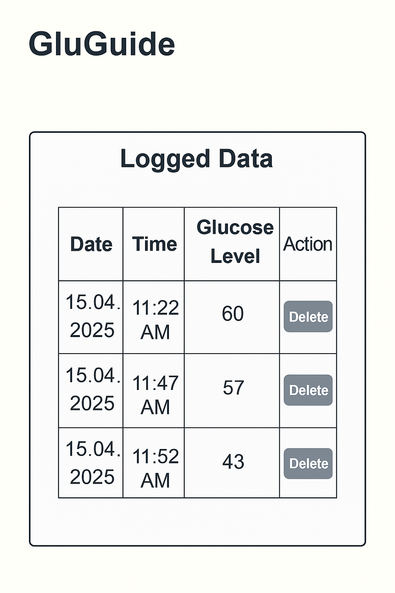

# Use-Case Specification: Manage Glucose Logs | Version 1.1

## 1. Use-Case: Manage Glucose Logs 
### 1.1 Brief Description  
This use case describes the creation, reading, updating, and deleting of glucose logs (CRUD) in the system.

---

## 2. Flow of Events  



### 2.1 Basic Flow  
In general, a user will view all glucose levels, create a new glucose log, edit or delete glucose log.

### 2.2 Creation
The user can track a new glucose level. To do so, the user enters data in the Glucose Tracking form.



This is our Mockup:



```gherkin
Feature: Create Glucose Log
    As a logged-in user
    I want to log my glucose level
    So that I can track my health effectively
  
  Scenario: Successfully create a glucose log
    Given I am on the glucose logging page
    When I enter a date
    And I enter a time
    And I enter a glucose level
    And I click the 'Submit' button
    Then my glucose entry is successfully created
    And I see the new entry in my logs list

  Scenario: Cancel glucose log creation
    Given I am on the glucose logging page
    When I start entering a date
    And I enter a time
    And I enter a glucose level
    And I click the 'Cancel' button
    Then I am redirected to the logging page
    And no glucose entry is created

```

### 2.3 Edit
The user can edit a glucose level. To do so, the user clicks on the "Edit" Button behind the glucose level in table.



This is our Mockup:



```gherkin
Feature: Edit Glucose Log
    As a logged-in user
    I want to edit an existing glucose log
    So that I can correct or refine my entry
  
  Scenario: Successfully edit a glucose log
    Given I am on the glucose logs page
    And I see an existing glucose entry
    When I click the "Edit" button
    And I modify the date, time, or glucose level
    And I click 'Submit' button
    Then the log entry is successfully updated
    And I see the updated entry in my logs list

  Scenario: Cancel glucose log edit
    Given I am on the glucose logs page
    And I click the "Edit" button
    And I start modifying the date, time, or glucose level
    And I click the 'Cancel' button
    Then the log remains unchanged
```
### 2.4 List
The user can list the glucose values. The default filter is "last 24 hours". With this filter the user sees the glucose logs of the last 24 hours in the graph. The table shows only the last three entries and has a button to show all glucose logs in that time period. The other filter options are "last 7 days", "last 30 days" and "all time".



This is our Mockup:



```gherkin
    Feature: List Glucose Logs
    As a logged-in user
    I want to see a list of all my glucose logs
    So that I can review my history and health trends
  
  Scenario: View all glucose logs
    Given I am on the logs dashboard
    When I scroll to the glucose logs list
    Then I see all my previous glucose entries

```
###  2.4 Delete

The User can delete a glucose log. 



This is our Mockup:




```gherkin
    Feature: Delete Glucose Log
    As a logged-in user
    I want to delete a glucose log entry
  
  Scenario: Successfully delete a glucose log
    Given I am on the glucose logs page
    And I see an existing glucose entry
    When I click the "Delete" button
    And a confirmation message appears
    And I click 'Yes'
    Then the glucose entry is successfully removed

  Scenario: Cancel deletion of a glucose log
    Given I am on the glucose logs page
    And I click the "Delete" button
    And a confirmation message appears
    And I click 'No'
    Then the log entry remains unchanged
```

## 3. Special Requirements

### 3.1 Owning an Account  
To create, edit, or delete a glucose log, the user must have an account. Only if the user is authenticated, the logging interface will be useable.

---

## 4. Preconditions

### 4.1 The user has to be logged in  
For privacy and security, the user must be logged in when managing glucose logs.

---

## 5. Postconditions

### 5.1 Create  
After submitting a new glucose log, the system will store the **date, time, and glucose level**, displaying the entry in the logs table and graph.

### 5.2 Edit  
Once the user updates their glucose log, the revised entry will reflect the new **date, time, or glucose value** in the logs list.

### 5.3 List  
When the user scrolls to the list of their glucose logs, the system will retrieve and present all **logged entries** in a structured format.

### 5.4 Delete  
After confirming deletion in the pop-up window, the glucose log entry will be **permanently removed** and no longer visible in the logs list or graph.
