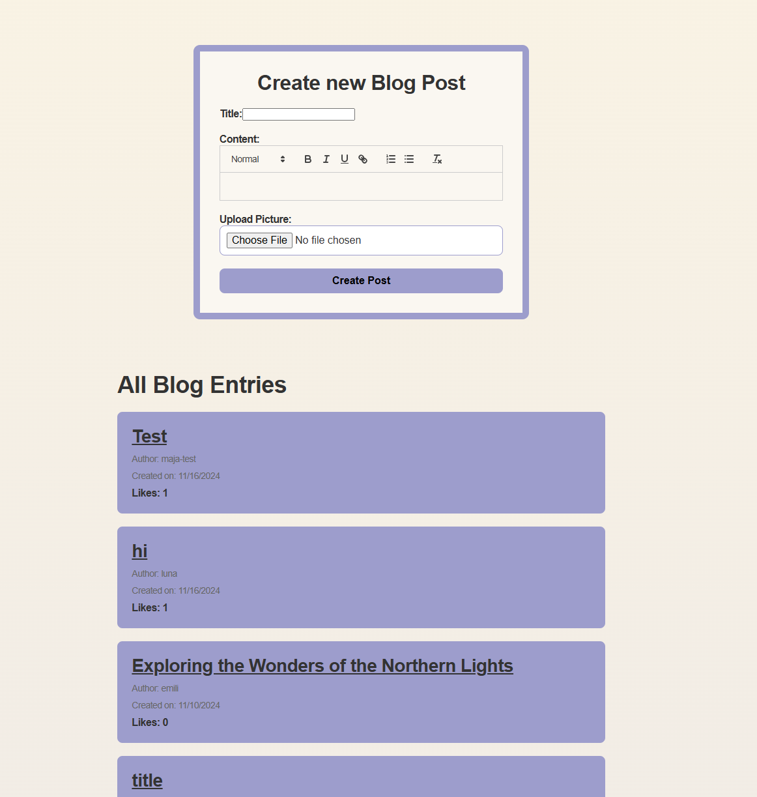
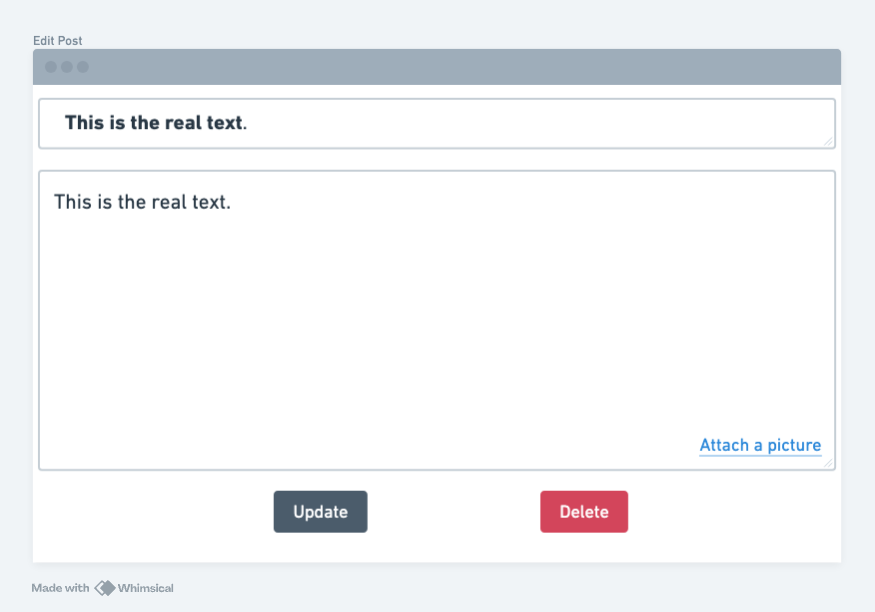
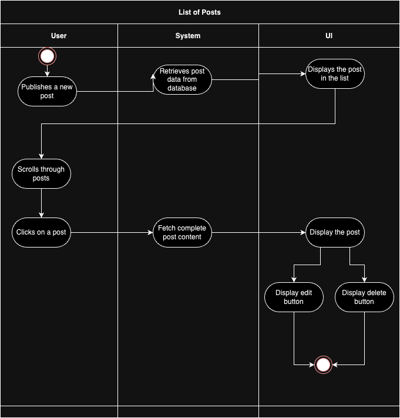
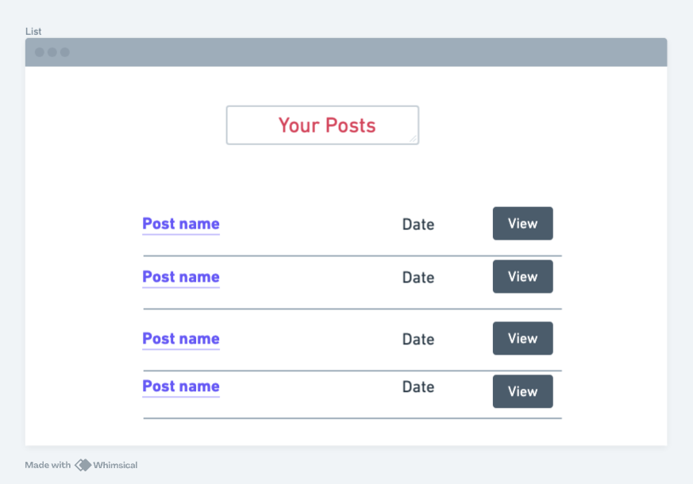
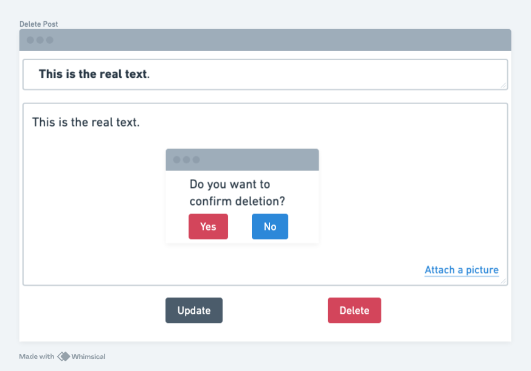
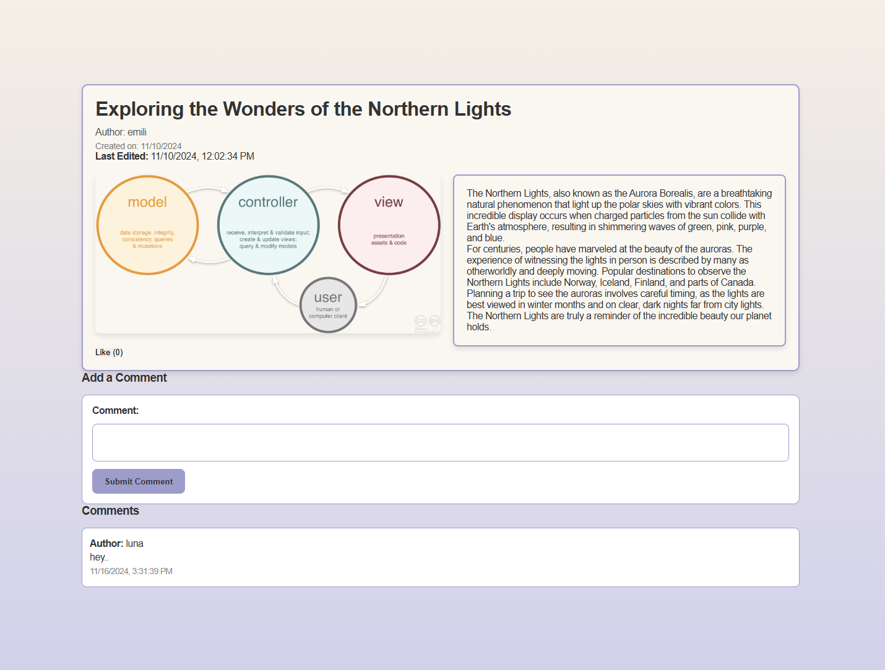

# Use-Case Specification: Manage Post | Version 1.1

## 1. Use-Case: Manage Post  
### 1.1 Brief Description  
This use case describes the creation, reading, updating, and deleting of posts (CRUD) in the system.

---

## 2. Flow of Events  

### 2.1 Basic Flow  
In general, a user will create a post, view all posts, edit them as needed, and occasionally delete posts.

### 2.2 Creation 

The creation of a new post. The user will be asked to enter a title and the content of the post.

This is what our blog looks like in our application:
 
 

### 2.3 Edit  
During editing, the user can modify the title and the content of the post.

### 2.4 List  
The user wants to be able to view all of their posts. Therefore, the system presents a list with all entries.

### 2.5 Delete  
The user can delete posts. We added a button in the edit page to delete an entry. To ensure the user does not accidentally delete a post, we added a modal asking for confirmation.

### 2.6 View Blogpost
This is a blogpost view: 
 

---

## 3. Special Requirements

### 3.1 Owning an Account  
In order to create, edit, or delete a post, the user must have an account. Only if the user is authenticated, the dialog for managing posts will be visible.

---

## 4. Preconditions

### 4.1 The user has to be logged in  
To ensure proper privacy and security, the user must be logged in when managing posts.

---

## 5. Postconditions

### 5.1 Create  
After creating a new post, the user will be redirected to the list overview, where the new entry will be displayed.

### 5.2 Edit  
After the user saves their edits, the updated post will be displayed in the list overview.

### 5.3 List  
When the user requests to list all posts, the system will fetch and display all existing posts in a paginated or scrollable format.

### 5.4 Delete  
After confirming the deletion in the pop up window that is shown, the post will be permanently removed and no longer displayed in the list overview.
