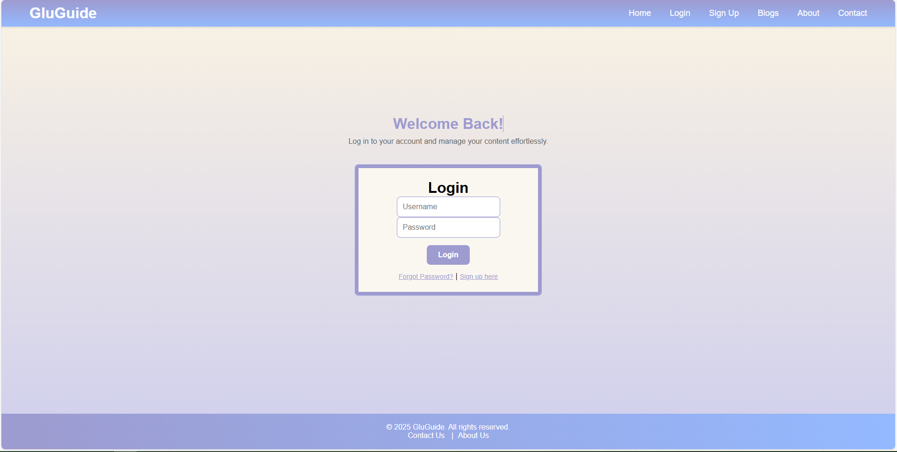

# Use-Case Specification: Forgot Password | Version 1.1

## 1. Use-Case: Forgot Password  
### 1.1 Brief Description  
This use case describes the process where users can reset their password if they forget it. Users can request a password reset, receive an email, set a new password, and regain access to their account.

---

## 2. Basic Flow  

1. The user **navigates to the login page**.
2. The user clicks on **"Forgot Password"**.
3. The user **enters their email address** in the provided field.
4. The system **checks if the email exists in the database**.
5. If the email exists:
   - The system **sends a password reset email** with a unique link.
6. The user **checks their email** and clicks on the password reset link.
7. The system **displays the password reset form**.
8. The user **enters a new password** and submits.
9. The system **updates the user's password** and confirms success.
10. The user can **log in using their new password**.

---

### 2.1 Activity Diagram  
<br>

---

### 2.2 Mock-up  

Login Page with Forgot Password Option:<br>
<br>

Forgot Password Form:<br>
<br>

Password Reset Email:<br>
<br>

Password Reset Page:<br>
<br>

---

### 2.3 Alternate Flow  
- **Invalid Email Address**  
  - If the **email is not found in the database**, the system **displays an error message** stating that the email is not recognized.
  
- **Expired or Invalid Reset Link**  
  - If the **user clicks on an expired or invalid reset link**, the system **informs them** that the link is no longer valid and prompts them to request a new password reset.

---

### 2.4 Narrative  
```gherkin
Feature: Forgot Password
    As a user
    I want to reset my password
    So that I can regain access to my account
  
  Scenario: Request password reset
    Given I am on the login page
    When I click the "Forgot Password" link
    And I enter my email address
    And I click the "Submit" button
    Then the system checks if the email exists
    And if found, sends a password reset email

  Scenario: Reset password successfully
    Given I have received a password reset email
    When I click on the reset link in the email
    And I enter a new password
    And I click the "Submit" button
    Then my password is successfully updated
    And I see a confirmation message
    And I can log in with the new password

  Scenario: Enter invalid email for password reset
    Given I am on the forgot password page
    When I enter an email that is not registered
    And I click the "Submit" button
    Then the system displays an error message
    And prompts me to enter a valid email
```
## 3. Preconditions  

### 3.1 User Access  
The user must be on the **landing page** of the web application, accessible from the home page or other entry points.

### 3.2 Authentication Status  
The user must be **logged into the system** before accessing account editing features.

### 3.3 Network and Server Connection  
The **Edit Account page** must be functional with an active connection to backend services such as **database and authentication servers**.

### 3.4 Form Availability  
All required fields (**username, email, password**) must be visible and accessible. The system must have proper **client-side validation scripts** for ensuring:
- Email format validity.
- Strong password enforcement.
- Unique username availability.

---

## 4. Postconditions  

### 4.1 Account Edit  
Once an account is edited, the system ensures:
- The **username, email, and hashed password** are securely stored in the database.
- Validation rules are correctly enforced (**unique email and username, strong password requirements**).

### 4.2 User Authentication  
After editing an account:
- The system **requires re-authentication**, prompting the user to log in with their updated credentials.

### 4.3 Verification Process (Optional)  
If email verification is enabled:
- The system **sends a verification email** with a link for confirmation.
- The account remains **"unverified"** until the user completes the verification step.

### 4.4 Error Handling (Optional)  
If an issue occurs during editing (e.g., **server downtime, network issues**), the system **displays an error message** prompting the user to retry later or contact support.

### 4.5 User Notification  
After a successful edit:
- A **confirmation message** is displayed to inform the user.
- If verification is required, the message **includes next steps** (e.g., _"Check your email to verify the edit."_).

### 4.6 Session Management  
If the user **remains logged in**, a new session is securely created. The session **persists until the user manually logs out or the session expires**.

---

## 5. Exceptions  

### 5.1 System Failure  
If the system encounters an issue during account editing (**e.g., server downtime**), it notifies the user and suggests trying again later.

---

## 6. Link to SRS  
This use case is linked to the relevant section of the [Software Requirements Specification (SRS)](SRS.md).

---

## 7. CRUD Classification  

### 7.1 Update Operation  
This use case falls under the **UPDATE** category in CRUD, handling the modification of user account details.
