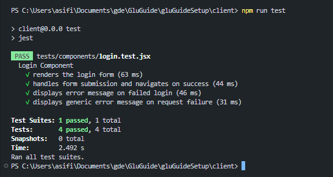
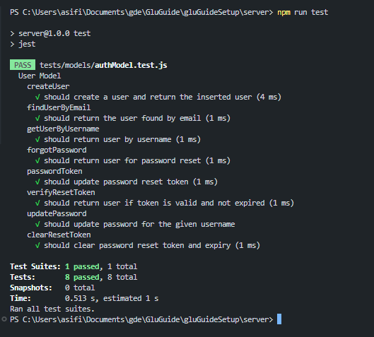
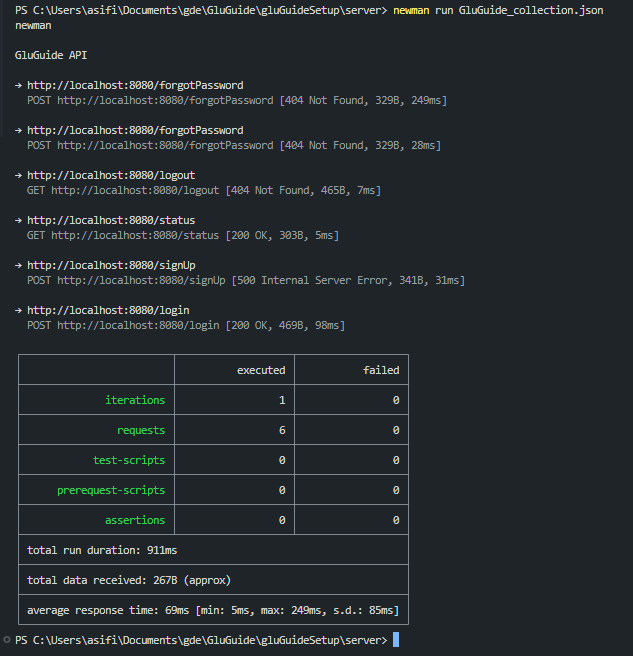

# Set Up

This project is a Vite-based React frontend with an Express.js backend with MVC pattern.

## Technologies Used
- **Frontend**: React, Vite
- **Backend**: Node.js, Express.js, PostgreSQL
- **Database**: PostgreSQL
- **Testing**: Jest, React Testing Library, Cucumber and Selenium, Postman
- **Version Control**: Git, GitHub

## Prerequisites

Make sure you have the following installed:

- [Node.js](https://nodejs.org/en/) (which includes npm)
- **PostgreSQL (version 14 or higher recommended):**
    - You'll need a local PostgreSQL server instance. You can download it from the official [PostgreSQL website](https://www.postgresql.org/download/). Follow the instructions for your operating system.
    - **Ensure your PostgreSQL service is running** before you proceed with the database setup.
        - **macOS (if installed via Homebrew):** `brew services start postgresql@14` (or your installed version). You can check status with `brew services list`.
        - **Linux (systemd):** `sudo systemctl start postgresql` and `sudo systemctl enable postgresql` (to start on boot). Check status with `sudo systemctl status postgresql`.
        - **Windows:** The installer usually sets it up as a service that starts automatically. You can check in `services.msc`.
    - Alternatively, for a more isolated environment, consider using Docker to run a PostgreSQL container.

## App

### Setting up dependencies

You can install all dependencies from the root directory (`/gluGuideSetup`):

```bash
# From the /gluGuideSetup folder
npm install
```

This will install the concurrently package for running both `client` and `server`, and then install dependencies for both the client and server.

Alternatively, you can install dependencies separately:

### 1. Install required plugins for the frontend client

Navigate to the `/client` folder and run the following command:

```bash
npm install
```

This will generate the `/node_modules` folder with all necessary plugins used in this project.

### 2. Install required plugins for the server

After Step 1 is done, return to the `/gluGuideSetup` folder and navigate to `/server` to do the same thing, but for the backend, running the same command:

```bash
npm install
```

### 3. Environment Configuration

This project uses environment variables to manage configuration. You'll need to create two `.env` files: one for the server and one for the client. Example files are provided in the repository (`server/.env.example` and `client/.env.example`).

#### 3.1. Server Environment (`server/.env`)

Navigate to the `/server` directory. Copy `server/.env.example` to a new file named `.env` in the same directory.

```bash
# From the /gluGuideSetup/server folder
cp .env.example .env
```

After copying, your `server/.env` file will look like this:
```
PGHOST=localhost
PGUSER=postgres 
PGPASSWORD=your_local_postgres_password 
PGDATABASE=gluguide_local_dev
PGPORT=5432 
SESSION_SECRET=a_very_strong_random_secret_for_your_session_please_change_me
```

Now, let's understand and update these settings:

-   `PGHOST=localhost`: Leave this as is. It tells the application to look for your PostgreSQL database on your own computer.
-   `PGUSER=postgres`: Leave this as `postgres`. This is the standard default administrative user for PostgreSQL. The setup steps later will assume you are using this user.
-   `PGPASSWORD=your_local_postgres_password`: **For now, you can leave this line as is.** The "Local Database Setup" section will guide you through setting a password for the `postgres` user *inside your database*. **After you complete those steps, you will need to come back to this `server/.env` file and update this `PGPASSWORD` line to match the password you set.**
-   `PGDATABASE=gluguide_local_dev`: Leave this as is. This will be the name of the database you create locally for this project.
-   `PGPORT=5432`: Leave this as is. This is the default port PostgreSQL uses.
-   `SESSION_SECRET=a_very_strong_random_secret_for_your_session_please_change_me`: **You MUST change this.** Replace the entire placeholder text with a long, random, and unique string. You can use a password generator to create a strong secret (e.g., at least 32 characters, mixed case, numbers, symbols). This secret is used to secure user sessions.

**For the Core GluGuide Team:** If you are working with the shared Aiven cloud database, you will replace the entire contents of `server/.env` with the specific Aiven credentials provided to you. The `.env` file is gitignored, so your credentials will remain local.

#### 3.2. Client Environment (`client/.env`)

Navigate to the `/client` directory. Copy `client/.env.example` to a new file named `.env` in the same directory.

```bash
# From the /gluGuideSetup/client folder
cp .env.example .env
```
This file tells the client application where the backend server is running:
```
VITE_API_URL=http://localhost:8080
```
You typically won't need to change this for local development.

### 4. Local Database Setup (For New Users & Local Development)

To run the application locally with pre-populated data (blog posts, sample users, etc.), you need to set up a local PostgreSQL database and import the provided data dump.

#### 4.1. Ensure your PostgreSQL Service is Running:
   - Refer to the "Prerequisites" section for OS-specific commands to start/check your PostgreSQL service.

#### 4.2. Configure PostgreSQL User and Create Database:

This typically involves using `psql`, PostgreSQL's command-line utility.

Connect to `psql` as a superuser (usually `postgres`). Open your terminal and try one of the following:

```bash
# On macOS (if installed via Homebrew) or Linux:
psql -U postgres -d postgres 
# If the above gives an error, try connecting without specifying a database initially:
psql -U postgres
# On Windows, psql should be in your PATH after installation. You might find it in:
# C:\Program Files\PostgreSQL\<version>\bin\psql.exe
# You might be prompted for the password for the 'postgres' user if you set one during installation.
# If you did not set one, it might connect directly or use 'peer' authentication on Linux.
```
You should see a `psql` prompt, like `postgres=#`.

**Troubleshooting Connection Issues:**
*   **If you see `FATAL: role "postgres" does not exist`:**
    This means your PostgreSQL installation doesn't have a default user named `postgres` or it was named differently (often to match your OS username).
    Try connecting with your operating system username instead:
    *   On macOS/Linux: `psql -U $(whoami) -d postgres` (or just `psql -U $(whoami)`)
    *   On Windows: `psql -U YourWindowsUsername -d postgres` (replace `YourWindowsUsername` with your actual username)
    
    If you successfully connect with your OS username (e.g., you see a `your_os_username=#` prompt), that username is likely your PostgreSQL superuser. You then have two choices:
    1.  **Option A (Recommended to easily follow this guide):** Create the `postgres` role yourself. Once connected to `psql` with your OS username, execute the following SQL commands:
        ```sql
        CREATE ROLE postgres WITH LOGIN SUPERUSER;
        -- Now, immediately set a password for this new 'postgres' role:
        ALTER ROLE postgres WITH PASSWORD 'your_chosen_password_for_postgres'; 
        ```
        Replace `your_chosen_password_for_postgres` with a secure password. Remember it!
        After these commands succeed, type `\q` to exit `psql`. Then, **return to the start of Step 2a** and try connecting as `postgres` (`psql -U postgres -d postgres`). It should now work, and you'll be prompted for the password you just set.
    2.  **Option B (Use your OS username for the project):** You can decide to use your OS username as the main PostgreSQL user for this project.
        *   If you choose this, you'll need to modify your `gluGuideSetup/server/.env` file later to set `PGUSER=your_os_username` (instead of `postgres`).
        *   You will also need to set a password for your OS username *as a PostgreSQL role* if it doesn't have one or if you want to change it. You'd do this in Step 2b, using `ALTER USER your_os_username WITH PASSWORD 'your_chosen_password';`.

*   **If you see `psql: error: connection to server on socket "/tmp/.s.PGSQL.5432" failed: No such file or directory` (or similar "connection refused" / "server not running" messages):**
    This usually means your PostgreSQL server is not running or not configured to listen on the default path/port. Please go back to the "Prerequisites" section and ensure your PostgreSQL service is started correctly for your operating system.

*   **If you see `psql: error: connection to server on socket "/var/run/postgresql/.s.PGSQL.5432" failed: FATAL:  Peer authentication failed for user "postgres”:**
  
    This error means PostgreSQL is using "peer authentication" for the `postgres` user when you connect locally. Peer authentication requires your operating system username to match the PostgreSQL username (`postgres` in this case). This often causes issues when your application (running as your normal OS user) tries to connect as the `postgres` database user.

    Here's a brief explanation of relevant authentication methods typically found in the `pg_hba.conf` file:
    *   **`peer`**: Checks if your OS username matches the database username.
        *   This is why commands like `sudo -u postgres psql ...` work (you temporarily become the `postgres` OS user), but connecting directly as your own OS user (while specifying `-U postgres` for the database) fails with this error if `peer` is configured for the `postgres` database user.
    *   **`md5` or `scram-sha-256`**: Uses password authentication. The client must supply the correct password. This is generally preferred for application connections. The `md5` method is common, while `scram-sha-256` is more secure if supported.
    *   **`trust`**: Allows connection without a password if other conditions (connection type, database, user, client address) match. While this might be a default on some systems (like macOS for local `postgres` user via Homebrew) for ease of initial setup, it's insecure and should be avoided for sensitive databases or production.

    **Understanding `pg_hba.conf`:**
    The `pg_hba.conf` file controls client authentication. PostgreSQL reads this file from top to bottom, and the *first* rule that matches the connection type, client address, requested database, and user is used.

    An example `pg_hba.conf` snippet that might cause this error on a Linux system for the `postgres` user:
    ```conf
    # TYPE  DATABASE        USER            ADDRESS                 METHOD
    # "local" is for Unix domain socket connections only
    local   all             postgres                                peer  # <--- This rule enforces peer auth for local 'postgres' user connections
    local   all             all                                     peer  # <--- This rule might enforce peer for all other local users
    # IPv4 local connections:
    host    all             all             127.0.0.1/32            scram-sha-256
    # IPv6 local connections:
    host    all             all             ::1/128                 scram-sha-256
    ```
    The line `local   all             postgres                                peer` explicitly tells PostgreSQL to use `peer` authentication for any local connection attempt made by the `postgres` database user.

    **How to Fix:**
    To allow your application (and `psql` running as your normal user) to connect to the `postgres` database user with a password, you need to change the authentication method for `local` connections for the `postgres` user from `peer` to `md5` (or `scram-sha-256`) in your `pg_hba.conf` file.

    1.  **Locate `pg_hba.conf`:**
        *   Commonly in `/etc/postgresql/<YOUR_PG_VERSION>/main/pg_hba.conf` on Debian/Ubuntu.
        *   Other locations depend on your OS and PostgreSQL installation method (e.g., `/usr/local/var/postgres/` on macOS with Homebrew).
    2.  **Edit the file** (requires `sudo` or root privileges). Make a backup first!
        Look for a line similar to:
        ```conf
        # TYPE  DATABASE        USER            ADDRESS                 METHOD
        # "local" is for Unix domain socket connections only
        local   all             postgres                                peer  # <--- This rule enforces peer auth for local 'postgres' user connections
        local   all             all                                     peer  # <--- This rule might enforce peer for all other local users
        # IPv4 local connections:
        host    all             all             127.0.0.1/32            scram-sha-256
        # IPv6 local connections:
        host    all             all             ::1/128                 scram-sha-256
        ```
        And change it to:
        ```conf
        # TYPE  DATABASE        USER            ADDRESS                 METHOD
        # "local" is for Unix domain socket connections only
        local   all             postgres                                md5
        local   all             all                                     peer
        # IPv4 local connections:
        host    all             all             127.0.0.1/32            scram-sha-256
        # IPv6 local connections:
        host    all             all             ::1/128                 scram-sha-256
        ```
        Or, if there's a more general rule like `local   all             all                                     peer` that is being matched, and you want to enable password auth for `postgres` specifically, you might add a new line *above* the general `peer` rule:
        ```conf
        # TYPE  DATABASE        USER            ADDRESS                 METHOD
        # "local" is for Unix domain socket connections only
        local   all             postgres                                md5
        local   all             all                                     peer
        # IPv4 local connections:
        host    all             all             127.0.0.1/32            scram-sha-256
        # IPv6 local connections:
        host    all             all             ::1/128                 scram-sha-256
        ```
        Ensure this new specific line for `postgres` appears *before* any more general `local ... peer` rule that might also apply.
    3.  **Restart PostgreSQL:**
        Apply the changes by restarting the PostgreSQL service (e.g., `sudo systemctl restart postgresql`).

    After these changes, and ensuring your `server/.env` has the correct `PGPASSWORD` set for `PGUSER=postgres`, your application should be able to connect using password authentication.

    _Thanks to Ephraim for testing our guide and helping us improve it! :)_

#### 4.3 Set/Verify the Password for the `postgres` User:
The application's `server/.env` file is configured to use the `PGUSER=postgres`. You need to ensure this user has a password that the application can use.
At the `psql` prompt (`postgres=#`), execute:
```sql
ALTER USER postgres WITH PASSWORD 'your_chosen_password';
```
Replace `your_chosen_password` with a secure password of your choice. **Remember this password!**
*(Note: If you prefer to use a different PostgreSQL user, you can create one and grant it necessary privileges, then update `PGUSER` and `PGPASSWORD` in `server/.env` accordingly. For simplicity, this guide uses the default `postgres` superuser.)*

#### 4.4 Create the Application Database:
At the `psql` prompt, execute:
```sql
CREATE DATABASE gluguide_local_dev;
```
*(If you wish to use a different database name, make sure to update `PGDATABASE` in your `server/.env` file to match.)*
You should see `CREATE DATABASE` as a confirmation.

Now you can exit by typing `\q` and press Enter.

### 5. Update `server/.env` with your PostgreSQL Password:
- Open the `gluGuideSetup/server/.env` file.
- Change the `PGPASSWORD` value to the password you set in step 2b:
 ```env
 PGPASSWORD=your_chosen_password
 ```

### 6. Load Initial Data into Your New Database:**
- Navigate to the `/server` directory in your terminal:
 ```bash
 cd path/to/your/gluGuideSetup/server
 ```
- Run the following npm script. This script provides instructions to use `psql` to load the `db_scripts/initial_data.sql` file into your `gluguide_local_dev` database.
 ```bash
 npm run db:setup-local
 ```
- The script will output a command. It will look something like this:
 `psql -U postgres -d gluguide_local_dev -f db_scripts/initial_data.sql`
- Copy and paste this command into your terminal and run it. You will be prompted for the password for the `postgres` user (the one you set in step 2b).
- If successful, you'll see a series of SQL command outputs (CREATE TABLE, INSERT, etc.).

Now your local database should be set up with the initial schema and data, and your application configured to connect to it!

**Note:** The `initial_data.sql` file contains a snapshot of the database. It's intended to get you started quickly.

## For the Core GluGuide Team: Updating the Shared Database Dump

If you are part of the core team and have made significant updates to the Aiven cloud database (e.g., added new features requiring schema changes, important seed data), you should update the `server/db_scripts/initial_data.sql` file so that new users and other team members can easily get the latest structure.

1.  **Ensure your `server/.env` points to the Aiven cloud database.**
2.  **Navigate to the `/server` directory in your terminal.**
3.  **Run the dump script:**
    ```bash
    # From the /gluGuideSetup/server folder
    npm run db:dump-for-sharing
    ```
    This script provides a template `pg_dump` command. You will need to replace the placeholder credentials (YOUR\_AIVEN\_USER, YOUR\_AIVEN\_HOST, etc.) with your actual Aiven credentials.
    You will be prompted for the password.
4.  **Commit and push** the updated `server/db_scripts/initial_data.sql` to the repository.

**Warning:** Before running the dump, ensure any sensitive or PII data not meant for public sharing has been removed or anonymized from the Aiven database if it's not a dedicated staging/dev instance.

### Starting the application

The application can be started in two ways:

#### Option 1: Start both client and server with a single command (recommended)

From the root `/gluGuideSetup` folder, run:

```bash
npm start
```

This will start both the server and client concurrently.

#### Option 2: Start client and server separately

If you prefer to start each part individually:

**For the client only:**
```bash
# From the /gluGuideSetup folder
npm run client
```
Or navigate to the `/client` folder and run:
```bash
npm run dev
```

**For the server only:**
```bash
# From the /gluGuideSetup folder
npm run server
```
Or navigate to the `/server` folder and run:
```bash
npm start
```

The server will be running on http://localhost:8080 by default.
The client will be running on http://localhost:5173 by default.

## Testing
To check why is the particular test stack chosen, please refer to the [TestingDoc.md](../TestingDoc.md) file.
### Frontend Testing
Create a test file in the `/client/src` folder. The test files should be named with a `.test.jsx` extension.
To run the frontend tests, navigate to the `/client` folder and run the tests by running the following commands:

```bash
cd client
npm run test
```
This will execute the tests using Jest and React Testing Library.  
Results should look like this:  


### Backend Testing
Create a test file inside the corresponding MVC subfolder under  `/server/tests/` folder. The test files should be named with a `.test.js` extension.
To run the backend tests, navigate to the `/server` folder and run the tests by running the following commands:

```bash
cd server
npm run test
```
This will execute the tests using Jest.  
Results should look like this:  


### End-to-End Testing
A complete guide can be found in the [Cucumber+Selenium.md](../featureFiles/Cucumber+Selenium.md).
To implement end-to-end tests using Cucumber.js, follow these steps:
1. Create a .feature file in the `/tests/features` folder. The feature files should be named with a `.feature` extension.
2. Create a corresponding step definition file in the `/test/features/step_definitions` folder. The step definition files should be named with a `.js` extension.
3. To run the end-to-end tests, navigate to the `/test` folder and run the tests by running the following commands:

```bash
cd test
npm test
```
This will execute the end-to-end tests using Cucumber.js.
To see the results and the complete guide please refer to the [Cucumber+Selenium.md](../featureFiles/Cucumber+Selenium.md) file.


### 'Automating' API Testing with Postman
1. Install Postman from the [official website](https://www.postman.com/downloads/).
2. Open Postman and create new collection.
3. Add requests to the collection for each API endpoint you want to test.
4. Set the request method (GET, POST, PUT, DELETE) and enter the URL for the API endpoint.
5. Add any required headers, parameters, or request body as needed.
6. Click the "Send" button to send the request and view the response.
7. You can also add tests to each request to validate the response. Postman allows you to write JavaScript code to check the response status, headers, and body.
8. Save your collection by exporting the collection as a JSON file. This will allow you import it into your codebase and automate the testing process.
9. To run the collection, you can use the Postman CLI tool called Newman. Install Newman globally using npm:

```bash
npm install -g newman
```
10. Run the collection using Newman by executing the following command in your terminal:

```bash
newman run newman run path/to/GluGuide_collection.json
```
This will execute all the requests in the collection and display the results in the terminal.  
Results should look like this:  


## Github

#### 1. Clone the repository

To get a copy of the project, run the following command:

```bash
git clone https://github.com/millisom/GluGuide.git
```

#### 2. Update to the Main Branch

Before making any changes, always ensure you are working on the latest version of the main branch:

```bash
git checkout main
git pull origin main
```

#### 3. Create a New Branch

To start working on a new feature or issue, create a new branch:

```bash
git checkout -b your-feature-branch
```

Replace your-feature-branch with a meaningful name for your new branch (e.g., feature/add-login-page).

#### 4. Push Changes to GitHub

After committing your changes locally, push your branch to GitHub:

```bash
git add .
git commit -m "Your descriptive commit message"
git push origin your-feature-branch
```

#### 5. Pull Requests

Once your work is complete, create a pull request to merge your changes into the main branch:

```bash
git checkout main
git pull origin main
git merge your-feature-branch
```

Push the changes to the main branch:

```bash
git push origin main
```

## Troubleshooting

If you run into any issues while running or developing the project, try the following steps:

#### Environment Variables Not Loaded:

Make sure you've created the `.env` file in the `/server` directory with all the required variables. If the application can't connect to the database or is missing configurations, check that your environment is properly loading the `.env` file.

#### Database Connection Problems:

If you experience issues connecting to the PostgreSQL database, double-check the credentials in your `.env` file. Ensure that the database server is reachable and the credentials are up-to-date. If you are using creditials provided by our team, please feel free to contact us.

#### Dependency Issues:

Errors related to missing modules or packages can often be resolved by reinstalling dependencies. Run the appropriate command (`npm install`) to ensure everything is correctly installed. It also helps to delete the `/node_modules` folder beforehand, as it will be regenerated by the install command anyways.

#### Application Startup Errors:

If the app crashes or fails to start, review the error messages in your terminal or log files. These messages usually provide hints about what's wrong. Sometimes, simply restarting the development server or clearing the cache can help. Should there be any errors related to functionality, please contact us so we can have a look at it and deploy a bug fix.

#### Frontend Build or Rendering Issues:

Should you encounter issues with the frontend (such as missing assets or rendering problems), confirm that the build process completed successfully and check your browser's console for error messages that might indicate what went wrong.

If these steps don't resolve the issue, try to isolate the problem by checking recent changes in the code, and consider reaching out to use for more assistance.
